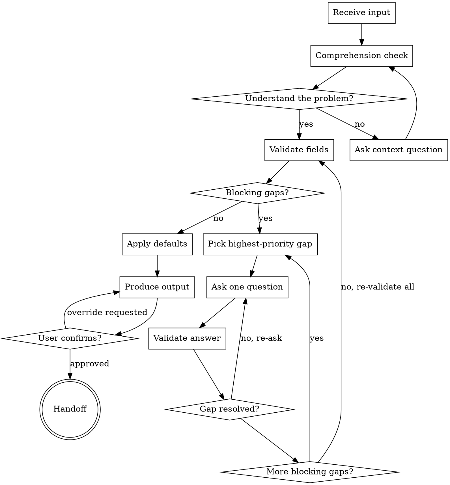

Turn incomplete or ambiguous user input into a fully validated specification through natural collaborative dialogue.

Start by understanding the user's intent, then ask questions one at a time to fill gaps. Once the specification is complete, produce the structured output and hand off to the next stage.

<HARD-GATE>
Do NOT produce output, apply defaults, or trigger handoff until all blocking gaps are resolved. This applies regardless of how complete the input appears. The clarification conversation must run to completion.
</HARD-GATE>

## Checklist

Complete these steps in order:

1. **Comprehension check** — understand what the user is trying to do before validating fields
2. **Validate fields** — classify each field as present, missing-blocking, or missing-non-blocking
3. **Clarification loop** — resolve blocking gaps one question at a time, in priority order
4. **Apply defaults** — fill non-blocking gaps with domain defaults, note what was assumed
5. **Produce output** — generate the structured report in the required format
6. **Confirm with user** — present the output, allow overrides before handoff

## Process Flow

**The terminal state is handoff.** The skill does not decide what happens after — the agent prompt defines the handoff mechanism.

## Understanding the Problem

Before checking any fields, make sure you understand what the user is trying to accomplish. You should be able to articulate:

- What is the user's goal?
- What are the key entities or options involved?
- What trade-offs matter most?

If you cannot answer these, ask. This is not a formal gap request — it is a conversation. Information that emerges here counts toward resolving formal gaps. If the user's answer to a context question also fills a required field, do not re-request it.

## Validating Fields

The agent prompt provides a **field taxonomy** — the list of fields, which are blocking vs non-blocking, and their priority order. Use it to classify the current state:

- **Present** — field is provided and well-formed.
- **Missing-blocking** — field is absent and cannot be defaulted. Must be resolved before output.
- **Missing-non-blocking** — field is absent but a domain default exists. Apply the default.

After each clarification answer, re-validate the full input set. New gaps can emerge (e.g., a provided dataset triggers validation issues). If they do, re-enter the loop.

## Asking Questions

Address blocking gaps in the priority order defined by the agent prompt. For each gap, select the appropriate question type:

**Provide** — field is entirely missing.
- Ask an open question.
- Explain why the information matters.
- Offer an example of what a good answer looks like.

**Choose** — input is ambiguous and you can infer likely options.
- Present the inferred options.
- Let the user pick or provide their own.
- Always leave room for "none of these."

**Fix** — field is present but malformed or insufficient.
- Explain what is wrong.
- Show what a corrected version could look like.
- Accept the user's correction in any reasonable format.

**Prefer multiple choice when possible.** When the user's input is ambiguous and you can infer likely options, present them as choices. Easier to answer than open-ended.

**No attempt limit.** Keep asking until all blocking gaps are resolved. Never give up, never skip a blocking field.

## Applying Defaults

Once all blocking gaps are resolved, apply domain defaults for missing non-blocking fields. The agent prompt provides a **defaults table** with values, rationale, and user-facing notes. Mention assumed defaults conversationally so the user knows and can override.

## Producing Output

Generate the structured output in the format defined by the agent prompt's **output template**. The skill does not own the template — the agent does.

## Confirming with User

Present the output. If the user wants to override an assumed default, accept the new value, update the output, and re-present. Only trigger handoff once the user confirms.

## Key Principles

- **Understand first, validate second** — comprehension before field-checking
- **One question at a time** — do not overwhelm with multiple questions
- **Multiple choice preferred** — easier to answer than open-ended when possible
- **Be conversational** — adapt phrasing to what the user said; use their terminology
- **Accept natural language** — if the answer contains the needed information, accept it regardless of format
- **Build on prior answers** — never re-ask what was already answered
- **Separate blocking from non-blocking** — only ask about blocking gaps; default the rest

## Anti-Patterns

| Anti-pattern | Why it fails |
|---|---|
| Dump all gaps at once | Overwhelms the user, leads to shallow answers |
| Repeat the full explanation | If the user partially answered, build on what they said |
| Reject natural language answers | Information is information, regardless of format |
| Ask about non-blocking gaps | Apply defaults and mention what was assumed |
| Be robotic | Sound like a conversation, not a form |
| Re-ask what was already answered | Track what the conversation has established |
| Skip comprehension check | Validating without understanding leads to wrong questions |
| Produce output with unresolved blocking gaps | The hard gate exists for a reason |

## Integration Contract

This skill expects the agent prompt to provide:

1. **Field taxonomy** — list of fields with blocking/non-blocking classification and priority order
2. **Defaults table** — values, rationale, and user-facing notes for non-blocking fields
3. **Output template** — the exact format for the structured output
4. **Handoff mechanism** — what happens after the user confirms (tool call, dispatch, etc.)
5. **Domain context** — background knowledge needed to understand user input

The skill owns the *how* (conversational strategy, question flow, loop structure). The agent owns the *what* (domain knowledge, field definitions, output format).
