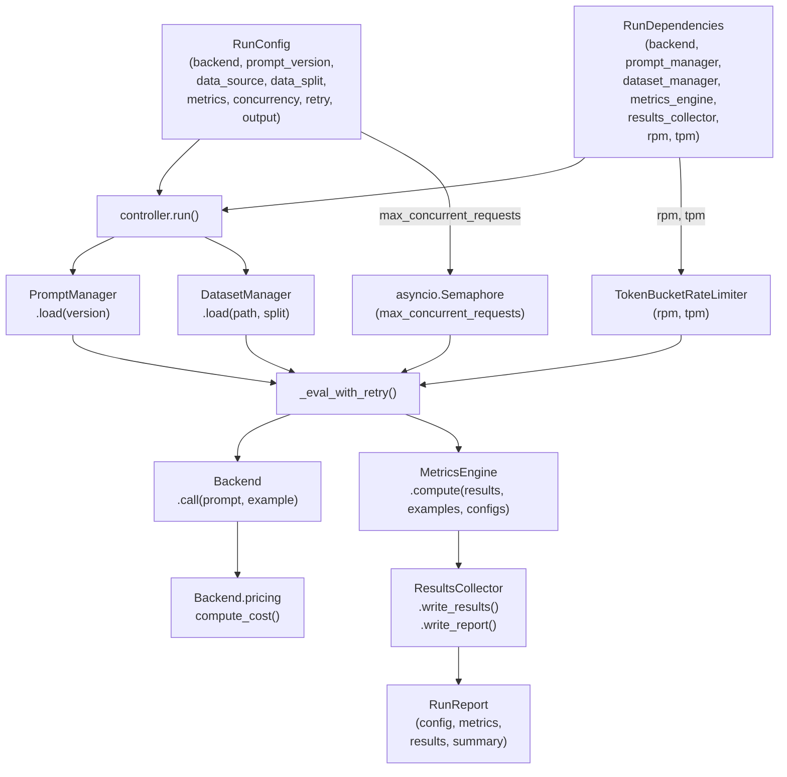

# Eval Framework — Architecture

## System diagram



---

## Data-flow walkthrough

`controller.run(config, deps)` executes in six steps that map directly to the diagram above.

**Step 1 — Load prompt and data**

```python
prompt = deps.prompt_manager.load(config.prompt_version)
examples = deps.dataset_manager.load(config.data_source, config.data_split)
```

`prompt_version` defaults to `"latest"`, which `FilePromptManager` resolves to the most recently modified file in the prompts directory. `DatasetManager` filters the JSONL to the requested split and returns a list of `Example` objects.

**Step 2 — Create concurrency primitives**

```python
rate_limiter = TokenBucketRateLimiter(
    requests_per_minute=deps.requests_per_minute,
    tokens_per_minute=deps.tokens_per_minute,
)
semaphore = asyncio.Semaphore(config.concurrency.max_concurrent_requests)
```

Rate limits come from `RunDependencies` (populated from the backend profile). `max_concurrent_requests` caps in-flight calls independent of the rate limiter.

**Step 3 — Fan out**

```python
tasks = [
    _eval_with_retry(deps.backend, prompt, example, config.retry, rate_limiter, semaphore)
    for example in examples
]
results = await asyncio.gather(*tasks)
```

All tasks are created up front. `asyncio.gather` drives them concurrently; the semaphore and rate limiter throttle execution.

**Step 4 — Per-call retry loop (`_eval_with_retry`)**

For each example, on each attempt:
1. `await rate_limiter.acquire()` — blocks until both request and token buckets are non-empty.
2. `async with semaphore` — acquires a concurrency slot.
3. `await asyncio.wait_for(backend.call(prompt, example), timeout=...)` — calls the LLM with a per-call timeout.
4. On success: `rate_limiter.consume_tokens(total_tokens)` deducts actual usage, `compute_cost(backend.pricing, usage)` prices the call (returns `None` when pricing is not configured), and an `EvalResult` is returned.
5. On exception: backoff (`backoff_factor ** attempt` seconds, outside the semaphore) then retry.
6. After all attempts exhausted: `EvalResult` with `error` set and `output=None`.

**Step 5 — Compute metrics**

```python
metrics = deps.metrics_engine.compute(list(results), examples, config.metrics)
```

`DefaultMetricsEngine.compute()` filters out errored results, pairs the remainder with their examples by ID, then dispatches each `MetricConfig` to the registered function. Returned dicts are merged; duplicate keys raise `ValueError`.

**Step 6 — Write outputs and return**

```python
deps.results_collector.write_results(list(results), config.output.results_path)
deps.results_collector.write_report(report, config.output.report_path)
return report
```

Output parent directories are created automatically (`mkdir -p`). If a report already exists at `report_path`, the collector logs a metric diff and cost/latency diff at `INFO` level before overwriting.

---

## Protocols and concrete implementations

| Protocol | Method signatures | Concrete implementation | Module |
|----------|------------------|------------------------|--------|
| `Backend` | `model_name: str` (property); `async call(prompt, example) → (dict, TokenUsage)` | `AnthropicBackend`, `OpenAIBackend`, `BedrockBackend` | `eval/backends/{anthropic,openai,bedrock}_backend.py` |
| `PromptManager` | `load(version: str) → str` | `FilePromptManager` | `prompts/manager.py` |
| `DatasetManager` | `load(path: str, split: "dev"\|"holdout") → list[Example]` | `JsonlDatasetManager` | `eval/dataset.py` |
| `MetricsEngine` | `compute(results, examples, metric_configs) → dict[str, float]` | `DefaultMetricsEngine` | `eval/metrics.py` |
| `ResultsCollector` | `write_results(results, path)`; `write_report(report, path)` | `JsonResultsCollector` | `eval/collector.py` |

All protocols are decorated `@runtime_checkable`, so `isinstance(obj, Backend)` works at runtime.

---

## RunConfig field reference

`RunConfig` is a Pydantic `BaseModel` loaded from YAML via `RunConfig.from_yaml(path)` or constructed directly.

| Field | Type | Default | Constraint |
|-------|------|---------|-----------|
| `backend` | `str` | required | Non-empty (stripped) |
| `prompt_version` | `str` | `"latest"` | Non-empty (stripped) |
| `data_source` | `str` | required | Non-empty (stripped) |
| `data_split` | `"dev" \| "holdout"` | required | Literal |
| `metrics` | `list[MetricConfig]` | required | At least one element |
| `concurrency` | `ConcurrencyConfig` | `ConcurrencyConfig()` | See below |
| `retry` | `RetryConfig` | `RetryConfig()` | See below |
| `output` | `OutputConfig` | `OutputConfig()` | See below |

### ConcurrencyConfig

> **Breaking change from earlier versions:** `requests_per_minute` and `tokens_per_minute` were removed from `ConcurrencyConfig`. They now live on `RunDependencies` (sourced from the backend profile). Any YAML or fixture that sets `concurrency.requests_per_minute` or `concurrency.tokens_per_minute` will raise a `ValidationError` because the model uses `extra="forbid"`.

| Field | Type | Default | Constraint |
|-------|------|---------|-----------|
| `max_concurrent_requests` | `int` | `20` | >= 1 |

### RetryConfig

| Field | Type | Default | Constraint |
|-------|------|---------|-----------|
| `max_attempts` | `int` | `3` | >= 1 |
| `backoff_factor` | `float` | `2.0` | >= 1.0 |
| `per_call_timeout_seconds` | `float` | `60.0` | > 0, <= 300 |

Cross-field: total worst-case duration (all backoff waits + all timeouts) must be <= 1800 s.

### OutputConfig

| Field | Type | Default | Constraint |
|-------|------|---------|-----------|
| `results_path` | `str` | `"outputs/results.jsonl"` | Must end with `.jsonl` |
| `report_path` | `str` | `"outputs/report.json"` | Must end with `.json` |

### MetricConfig

| Field | Type | Default | Constraint |
|-------|------|---------|-----------|
| `name` | `str` | required | Non-empty (stripped) |
| `params` | `dict[str, Any]` | `{}` | Forwarded as kwargs to the metric function |

---

## RunDependencies field reference

`RunDependencies` is a `dataclasses.dataclass`. The controller accepts it as its second argument. The MCP layer (or any caller) is responsible for constructing it.

| Field | Type | Notes |
|-------|------|-------|
| `backend` | `Backend` | Satisfies the `Backend` protocol |
| `prompt_manager` | `PromptManager` | Satisfies the `PromptManager` protocol |
| `dataset_manager` | `DatasetManager` | Satisfies the `DatasetManager` protocol |
| `metrics_engine` | `MetricsEngine` | Satisfies the `MetricsEngine` protocol |
| `results_collector` | `ResultsCollector` | Satisfies the `ResultsCollector` protocol |
| `requests_per_minute` | `int` | >= 1; sourced from `BackendProfile.requests_per_minute` |
| `tokens_per_minute` | `int` | >= 1; sourced from `BackendProfile.tokens_per_minute` |

`__post_init__` validates that both rate-limit fields are >= 1 and raises `ValueError` otherwise.

---

## TokenBucketRateLimiter

`eval/rate_limiter.py` — `TokenBucketRateLimiter`

Maintains two leaky buckets: one for requests per minute (RPM) and one for tokens per minute (TPM). Both refill continuously based on elapsed time.

**Constructor**

```python
TokenBucketRateLimiter(
    requests_per_minute: int,
    tokens_per_minute: int,
    time_fn: Callable[[], float] | None = None,  # defaults to time.monotonic
)
```

`time_fn` is injectable for deterministic unit tests (pass a fake clock).

**`async acquire() → None`**

Blocks until both conditions are satisfied:
- `request_balance >= 1.0`
- `token_balance > 0`

On each iteration it refills both buckets, checks the conditions, and if not satisfied, computes the minimum sleep needed for either bucket to become unblocked. After returning, `request_balance` is decremented by 1. Protected by an `asyncio.Lock` to prevent concurrent refill races.

**`consume_tokens(tokens: int) → None`**

Deducts `tokens` from `token_balance` after a call completes. May drive the balance negative (the next `acquire()` will then wait for refill). Intentionally lock-free: asyncio's cooperative model guarantees this synchronous method executes atomically between `await` points.

**Acquire/consume split rationale:** Token count is not known until the API responds. The acquire checks only that the balance is positive (not zero); consume applies the actual deduction post-call. This prevents unbounded over-dispatch without requiring an upfront token estimate.

---

## DefaultMetricsEngine

`eval/metrics.py` — `DefaultMetricsEngine`

A registry mapping metric names to `MetricFn = Callable[..., dict[str, float]]`. Satisfies the `MetricsEngine` protocol.

**`register(name, fn)`** — adds or overwrites a metric function.

**`compute(results, examples, metric_configs) → dict[str, float]`**

1. Builds an `{id: Example}` lookup from `examples`.
2. Filters `results` to those with `error is None` and a matching example.
3. For each `MetricConfig`, looks up the registered function, calls it with `(filtered_results, filtered_examples, **config.params)`, and merges the returned dict.
4. Raises `ValueError` on unknown metric name or duplicate output key.

**`create_default_engine()`** registers all four built-in metrics and returns the engine.

### Built-in metrics

#### `accuracy`

Fraction of predictions where `output["route"] == expected["route"]`.

Output keys:

| Key | Type | Description |
|-----|------|-------------|
| `accuracy` | `float` | Proportion correct (0.0–1.0) |

#### `confusion`

Full confusion matrix as a flat dict.

Output keys: `confusion/{true_class}/{predicted_class}` → `float` count, for every combination of observed classes.

Example with classes `fast`, `slow`:
```
confusion/fast/fast, confusion/fast/slow,
confusion/slow/fast, confusion/slow/slow
```

#### `f1`

Per-class precision, recall, F1, and macro-averaged F1.

Output keys:

| Key pattern | Description |
|-------------|-------------|
| `precision/{class}` | TP / (TP + FP) |
| `recall/{class}` | TP / (TP + FN) |
| `f1/{class}` | Harmonic mean of precision and recall |
| `f1/macro` | Unweighted mean F1 across all classes |

#### `cost_quality_change`

Percentage change in routing cost and quality vs a baseline route class, plus oracle bounds. Useful for measuring how well the router trades cost against quality relative to always-picking-the-best-model.

Parameters (via `MetricConfig.params`):

| Param | Type | Default | Description |
|-------|------|---------|-------------|
| `baseline_class` | `str \| None` | `None` | Route to compare against. Auto-selects the class with highest mean `quality_score` when `None`; tie-breaks alphabetically. |

Output keys:

| Key | Description |
|-----|-------------|
| `cost_change` | `(predicted_cost − baseline_cost) / baseline_cost` (model cost only, excludes routing overhead) |
| `cost_change_with_overhead` | `(predicted_cost + routing_overhead − baseline_cost) / baseline_cost` (includes routing call cost) |
| `quality_change` | `(predicted_quality − baseline_quality) / baseline_quality` |
| `oracle_cost_change` | Same ratio for the ground-truth optimal route |
| `oracle_quality_change` | Same ratio for the ground-truth optimal route |

Negative values indicate the router is cheaper/lower-quality than baseline. Hallucinated route predictions (route label not in `expected["routes"]`) are skipped with a warning.

Expected example shape for this metric:
```json
{
  "id": "ex-001",
  "input": { "query": "..." },
  "expected": {
    "route": "fast",
    "routes": {
      "fast":  { "cost": 0.001, "quality_score": 0.82 },
      "slow":  { "cost": 0.012, "quality_score": 0.97 }
    }
  }
}
```

---

## JsonlDatasetManager

`eval/dataset.py` — `JsonlDatasetManager`

**`load(path, split) → list[Example]`**

Reads a JSONL file line by line, skips blank lines, and returns `Example` objects where the line's `split` field matches the requested split.

### JSONL line format

Each line must be a JSON object with these fields:

| Field | Type | Description |
|-------|------|-------------|
| `id` | `str` | Unique example identifier |
| `input` | `dict` | Model input (arbitrary structure) |
| `expected` | `dict` | Ground-truth labels (structure depends on metrics used) |
| `split` | `"dev" \| "holdout"` | Partition tag; lines that don't match the requested split are skipped |

### Holdout access guard

Requesting `split="holdout"` raises `PermissionError` unless the environment variable `ALLOW_HOLDOUT=1` is set. This prevents accidental holdout evaluation during prompt-iteration workflows.

### Error behaviour

| Condition | Error raised |
|-----------|-------------|
| File not found | `FileNotFoundError` (from `open()`) |
| Invalid JSON on a line | `ValueError` with line number |
| Missing `id`, `input`, or `expected` field | `ValueError` with line number |
| `split="holdout"` without `ALLOW_HOLDOUT=1` | `PermissionError` |

---

## JsonResultsCollector

`eval/collector.py` — `JsonResultsCollector`

**`write_results(results, path)`** — writes each `EvalResult` as a single JSON line (via `model_dump_json()`). Overwrites `path`.

**`write_report(report, path)`** — writes `RunReport` as pretty-printed JSON (indent=2). Before writing, reads the existing file (if any) and logs two diffs:

- **Metric diff** — for each key present in old or new metrics: logs `old → new` for changed values, `(new) value` for additions, `value (removed)` for removals.
- **Overhead diff** — logs changes in `total_cost` and `duration_seconds` from the previous run's summary.

Both diffs are logged at `INFO` level. A `JSONDecodeError` in the previous report is silently ignored.

---

## FilePromptManager

`prompts/manager.py` — `FilePromptManager`

**Constructor**: `FilePromptManager(prompts_dir: str | Path)`

Scans `prompts_dir` on construction, populating an in-memory cache: `{stem: content}`.

**File extension priority** (first match wins for a given stem):
1. `.yaml`
2. `.yml`
3. `.txt`

**`load(version: str) → str`**

- `version="latest"` → returns the content of the file with the highest `mtime`.
- Any other version → returns the cached content for `stem == version`, or raises `FileNotFoundError`.

**`async watch() → None`**

Long-running coroutine. Performs an immediate rescan on entry (to catch changes between construction and watch start), then uses `watchfiles.awatch()` to rescan on any filesystem change in `prompts_dir`. Cancel the task to stop watching.

Typical usage:
```python
manager = FilePromptManager("prompts")
watch_task = asyncio.create_task(manager.watch())
# ... run eval loop ...
watch_task.cancel()
```

---

## Pricing

`eval/pricing.py`

### `ModelPricing`

Per-token pricing is defined inline on each backend profile via the optional `pricing` field. Costs are expressed per million tokens (matching provider pricing pages).

| Field | Type | Description |
|-------|------|-------------|
| `input_cost_per_million_tokens` | `float` | Cost per 1M non-cached input tokens |
| `cached_cost_per_million_tokens` | `float` | Cost per 1M cache-read input tokens |
| `output_cost_per_million_tokens` | `float` | Cost per 1M generated output tokens |

Example in a backend YAML file:

```yaml
pricing:
  input_cost_per_million_tokens: 3.0
  cached_cost_per_million_tokens: 0.3
  output_cost_per_million_tokens: 15.0
```

### `compute_cost(pricing, usage) → float | None`

Returns `None` if `pricing` is `None` (backend has no pricing configured) — cost is not tracked for those backends. The controller stores this as `EvalResult.cost = None`.

`TokenUsage` fields are disjoint (Anthropic-style): `input_tokens` is non-cached input, `cached_tokens` is cache-read input, `output_tokens` is generated tokens.

---

## Output models

### EvalResult

Produced by `_eval_with_retry` for every example, regardless of success or failure.

| Field | Type | Notes |
|-------|------|-------|
| `example_id` | `str` | From `Example.id` |
| `model` | `str` | `Backend.model_name` |
| `output` | `dict \| None` | `{"content": "..."}` on success; `None` on failure |
| `error` | `str \| None` | `"ExcType: message"` on failure; `None` on success |
| `latency_ms` | `float` | Wall time for the final attempt |
| `retries` | `int` | Number of retries (0 = succeeded on first attempt) |
| `token_usage` | `TokenUsage \| None` | `None` on failure |
| `cost` | `float \| None` | `None` on failure or unknown model |

### TokenUsage

| Field | Type | Description |
|-------|------|-------------|
| `input_tokens` | `int` | Non-cached input tokens |
| `cached_tokens` | `int` | Cache-read input tokens (0 if not supported) |
| `output_tokens` | `int` | Generated tokens |

### RunSummary

| Field | Type | Description |
|-------|------|-------------|
| `total` | `int` | Total examples |
| `succeeded` | `int` | Examples with `error is None` |
| `failed` | `int` | `total - succeeded` |
| `total_cost` | `float` | Sum of all `EvalResult.cost` (None treated as 0) |
| `start_time` | `datetime` | UTC run start |
| `end_time` | `datetime` | UTC run end |
| `duration_seconds` | `float` | Wall time |

### RunReport

| Field | Type | Description |
|-------|------|-------------|
| `config` | `RunConfig` | The config that produced this report |
| `metrics` | `dict[str, float]` | All computed metric values |
| `results` | `list[EvalResult]` | Per-example results |
| `summary` | `RunSummary` | Aggregate statistics |
