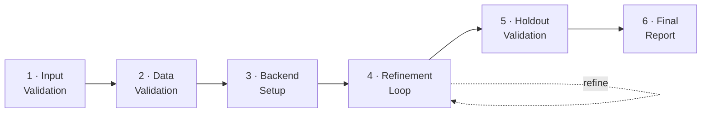
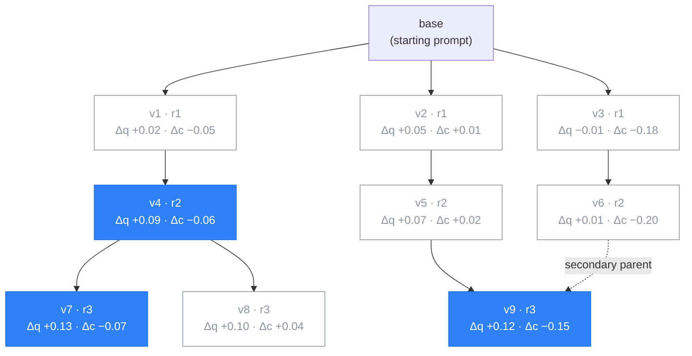

# Project Compass  
[](LICENSE)
[]()

**Improved Agentic Routing Optimizer** — a multi-agent pipeline that iteratively refines few-shot routing prompts using an automated evaluation loop. Deployed as an [MCP (Model Context Protocol)](https://modelcontextprotocol.io) server.

> 📄 This repo accompanies a research paper (link to follow once published). See [`datasets/`](datasets/) for the paper's appendix datasets.

Given a routing dataset, a problem description, and target metrics, Compass validates the data, sets up the evaluation backend, and iteratively builds and refines a prompt through an automated eval-review-revise loop — producing a production-ready routing prompt with full performance transparency.

---

## Pipeline

Compass runs as six sequential stages with an inner refinement loop. Each stage runs as its own sub-agent, dispatched by the orchestrator via `start_stage` / `complete_stage`.



**Input:** routing dataset + problem description + target metrics. **Output:** a production-ready routing prompt + evaluation report.

Each stage runs as its own sub-agent, dispatched by the orchestrator via `start_stage` / `complete_stage`. Stage 4 is an inner loop: Prompt Builder compiles candidate prompts, the Eval Runner scores them on the dev split, and the Review Agent ranks results and proposes child variants until the search converges.

Internally the orchestrator tracks five dispatcher stages (`compass/agents/pipeline/status.py`): Holdout Validation and Final Report are handled by one stage. See [`docs/architecture.md`](docs/architecture.md) for the agent-level view and [`docs/algorithm.md`](docs/algorithm.md) for the search algorithm.

---

## Setup

Compass runs as an MCP server. Pick the setup that matches your client.

### Prerequisites

- [uv](https://docs.astral.sh/uv/) (Python package manager)
- API keys for your LLM backend(s):

```bash
# Add to your shell profile (~/.zshrc, ~/.bashrc)
export ANTHROPIC_API_KEY="sk-ant-..."   # For Claude backends
export OPENAI_API_KEY="sk-..."          # For OpenAI backends
```

### Claude Code

One command:

```bash
claude mcp add compass -- uvx --from git+https://github.com/ProsusAI/Compass compass
```

The server inherits your shell environment, so exported API keys work automatically.

To pass keys explicitly instead:

```bash
claude mcp add compass \
  -e ANTHROPIC_API_KEY=sk-ant-... \
  -e OPENAI_API_KEY=sk-... \
  -- uvx --from git+https://github.com/ProsusAI/Compass compass
```

Verify with `claude mcp list`.

### Claude Desktop

Add to `claude_desktop_config.json`:

```json
{
  "mcpServers": {
    "compass": {
      "command": "uvx",
      "args": ["--from", "git+https://github.com/ProsusAI/Compass", "compass"]
    }
  }
}
```

### Cursor / Windsurf

Add to `.cursor/mcp.json` (or equivalent):

```json
{
  "mcpServers": {
    "compass": {
      "command": "uvx",
      "args": ["--from", "git+https://github.com/ProsusAI/Compass", "compass"],
      "env": {
        "ANTHROPIC_API_KEY": "${ANTHROPIC_API_KEY}",
        "OPENAI_API_KEY": "${OPENAI_API_KEY}"
      }
    }
  }
}
```

Cursor does not inherit your shell environment — you must forward API keys via the `env` block. The `${VAR}` syntax references variables from your shell profile. Alternatively, set them in **Cursor Settings > Environment Variables**.

### Any MCP-compatible client

Add to your client's MCP config (usually `.mcp.json`):

```json
{
  "mcpServers": {
    "compass": {
      "command": "uvx",
      "args": ["--from", "git+https://github.com/ProsusAI/Compass", "compass"]
    }
  }
}
```

### Project initialization

After connecting the server, run `compass init` in your project directory:

```bash
compass init
```

This creates:
- `backends/` — LLM backend configs (a `mock-echo.yaml` starter is included)
- `prompts/` — versioned routing prompts
- `outputs/` — run outputs, reports, and config (`run_config.yaml` starter included)

The command is idempotent and will not overwrite existing files.

### Development setup

```bash
git clone https://github.com/ProsusAI/Compass.git
cd Compass
uv sync
```

For local development, create a `.mcp.json` in the project root that runs the server from source:

```json
{
  "mcpServers": {
    "compass": {
      "command": "uv",
      "args": ["run", "python", "-m", "compass.mcp"]
    }
  }
}
```

---

## Quickstart: run the included dataset

This walks through a full pipeline run against a bundled dataset using the `mock-echo` backend — no API key, no cost. It assumes an MCP client that can drive multi-step tool conversations (the examples use Claude Code).

1. **Clone and install:**
   ```bash
   git clone https://github.com/ProsusAI/Compass.git
   cd Compass
   uv sync
   ```

2. **Register the server from source.** Create `.mcp.json` in the repo root:
   ```json
   {
     "mcpServers": {
       "compass": {
         "command": "uv",
         "args": ["run", "python", "-m", "compass.mcp"]
       }
     }
   }
   ```
   File I/O (`outputs/`, `prompts/`, `backends/`) resolves against the server's working directory. If your client does not start the server with the repo as its working directory, set `COMPASS_PROJECT_DIR` (or a `cwd` key) to the repo path — see [`docs/architecture.md`](docs/architecture.md) §8.

3. **Scaffold the project directories:**
   ```bash
   uv run compass init
   ```
   This creates `outputs/`, `prompts/`, and `backends/` with a `mock-echo.yaml` starter. `mock-echo` needs no API key.

4. **Start the run.** Open the repo in your MCP client and send:
   > Optimize a routing prompt. Dataset: `tests/scenarios/data/full_pipeline_dataset.jsonl` (100 labelled examples — 50 haiku, 30 sonnet, 20 opus). Problem: route customer-support queries to haiku, sonnet, or opus by complexity — simple factual questions go to haiku, moderate multi-step tasks to sonnet, complex reasoning or ambiguous edge cases to opus. Target accuracy ≥ 0.90, evaluation threshold 0.80, split ratio 0.70, max 5 iterations. Use the `mock-echo` backend.

5. **What happens.** The six stages run as sub-agents. You confirm the field mapping in Stage 2; everything else is automatic. The run writes everything under `outputs/<run_id>/`:
   ```
   outputs/<run_id>/
     input/input_report.md        # Stage 1
     validation/                  # Stage 2 — quality report, routing context
     analysis/dev.jsonl           # Stage 2 — dev / holdout split
     analysis/holdout.jsonl
     search/search_state.json     # Stage 4 — beam search state, elite set, round history
     search/viz.html              # Stage 4 — interactive candidate tree + Pareto scatter
     eval/v*/report.json          # Stage 4 — per-candidate dev scores
     holdout_eval/v*/report.json  # Stage 5 — per-candidate holdout scores
     reports/final_report.md      # Stage 6 — the report to read
     reports/charts/*.png
   ```

6. **Read the output.** Open `outputs/<run_id>/reports/final_report.md` — Executive Summary, Compared Candidates, Candidate Details (full prompt text, per-class metrics, confusion matrix), Optimization Process, and Pareto Front. Open `outputs/<run_id>/search/viz.html` in a browser to explore the candidate search tree.

> **`mock-echo` is a plumbing test, not a real optimization.** It echoes the ground-truth route, so accuracy is ≈ 1.0 and the loop converges on the first round. It still exercises every stage and produces a real report in the real format. For a genuine run, add an `anthropic` or `openai` backend profile in `backends/` (needs the matching API key) and point Stage 1 at your own dataset in the canonical schema ([`compass/agents/data_validation/format.md`](compass/agents/data_validation/format.md)).

---

## Usage

After setup, start the pipeline by asking your MCP-connected assistant:

> Optimize a routing prompt

Compass walks through six stages. Each stage runs as a sub-agent — you interact with it conversationally, and it calls the appropriate MCP tools behind the scenes. Here's what happens at each stage and what you need to provide.

### Stage 1: Input Validation

The pipeline starts by collecting and validating your input.

**What you provide:**
- **Routing dataset** — a JSONL, CSV, or JSON file where each row contains a query and a ground-truth routing decision
- **Problem description** — a natural language explanation of the routing task (what each tier/class means, when to route where)
- **Target metrics** — the metrics and thresholds that define success (e.g. "accuracy >= 0.90", "F1 >= 0.85 per class")

The agent checks for blocking gaps (missing dataset, no problem description) and flags non-blocking issues (class imbalance, missing cost data) with assumed defaults. If anything is blocking, it asks for clarification before proceeding.

### Stage 2: Data Validation

Automatically detects your dataset format, maps fields to the canonical schema, and runs quality checks.

**What you may be asked:**
- **Field mapping confirmation** — if column names don't match the expected schema, the agent proposes a mapping and asks you to confirm

The stage produces a data quality report covering schema conformance, label distribution, volume adequacy, and query diversity. It also builds a routing context document that downstream stages use.

### Stage 3: Backend Setup

Configures the LLM backend used for evaluation.

**What you provide:**
- **Backend selection** — which LLM provider and model to use for evaluation (e.g. "openai/gpt-5.2", "anthropic/claude-haiku-4-5")

The agent looks up default pricing and writes a backend config file. A starter `mock-echo.yaml` config is included from `compass init` for testing.

### Stage 4: Refinement Loop

The core refinement loop. Starts with seed example selection, compiles an initial prompt, then iteratively evaluates and improves it.

**What happens (no input needed):**
1. **Seed selection** — the Review Agent performs a cold-start pass to select representative seed examples from the dev split
2. **Initial prompt (v1)** — the Prompt Builder compiles the first versioned prompt using the analysis output, rationale cards, and selected seed examples
3. **Evaluation** — the eval engine runs the prompt against the dev dataset and produces a score report (accuracy, per-class F1, latency, cost)
4. **Review** — the Review Agent analyses results, decides whether to accept or revert, and generates ranked improvement directives
5. **Revision** — the Prompt Builder revises the prompt based on the Review Agent's directives
6. Steps 3–5 repeat until the loop converges (no further improvement) or hits the round limit

The loop tracks a Pareto front of candidates (quality vs. cost) and detects stagnation to avoid wasting iterations.

**Inside the loop: the candidate search tree.** The refinement loop is a **beam search** (`beam_width = 3`) over prompt candidates. Round 1 seeds three diverse candidates from `base`; round 2 gives each seed one child; from round 3 on, the Review Agent spends the three-child budget across the most promising members of the current elite set — concentrating (3 children on 1 parent), splitting (2 + 1), or spreading (1 + 1 + 1) — and may merge two parents into one child. After every round the elite set is recomputed as the non-dominated (quality ↑, cost ↓) front and pruned by NSGA-II crowding distance to `2·beam_width + 1 = 7`. The loop stops when the evaluation budget (default 60) is spent and hypervolume has stagnated, when `max_rounds` is reached, or when the Review Agent signals `exit`.



Filled nodes are on the current Pareto front; outlined nodes were evaluated but dominated. Each node shows its version, the round it was introduced (`r1`…), and its quality / cost change versus the baseline route. A live, interactive version of this tree — with the quality/cost Pareto scatter and a per-round slider — is written to `outputs/<run_id>/search/viz.html` after every round.

### Stage 5: Holdout Validation

Tests the best prompt from the eval loop on the held-out data.

**What happens (no input needed):**
- Filters few-shot examples out of the holdout set to prevent data contamination
- Runs a final evaluation on unseen data
- Produces a holdout score report with per-class breakdowns

### Stage 6: Final Report

Synthesises all pipeline artifacts into a structured evaluation report.

**What you get:**
- **Final versioned prompt** — the production-ready routing prompt (YAML/JSON)
- **Evaluation report** — executive summary, data profile, iteration history, holdout performance, confidence assessment, deployment guidance, and reproducibility block

---

## Datasets

The [`datasets/`](datasets/) directory contains supplementary datasets accompanying the Compass paper appendix (model routing and image-generation routing benchmarks), licensed separately under CC-BY-4.0. See [`datasets/README.md`](datasets/README.md) for the data card.

These appendix datasets are research artifacts and are **not** in Compass's runnable routing schema. For a dataset you can run the pipeline against out of the box, use [`tests/scenarios/data/full_pipeline_dataset.jsonl`](tests/scenarios/data/full_pipeline_dataset.jsonl) — see [Quickstart](#quickstart-run-the-included-dataset).

---

## Environment Variables

| Variable | Description |
|---|---|
| `ANTHROPIC_API_KEY` | Anthropic API key (required for Claude backends) |
| `OPENAI_API_KEY` | OpenAI API key (required for OpenAI-compatible backends) |

---

## License

Copyright © 2026 MIH AI B.V.

Project Compass is licensed under the [Apache License, Version 2.0](LICENSE). See
the [`NOTICE`](NOTICE) file for third-party attributions.

### Dependencies

Runtime dependencies are retrieved at install time and are not redistributed in
this repository. Their licenses:

| Dependency | License |
|---|---|
| `mcp`, `anthropic`, `pyyaml`, `pydantic` | MIT |
| `openai`, `boto3`, `aiohttp` | Apache-2.0 (`aiohttp`: Apache-2.0 AND MIT) |
| `matplotlib` | Matplotlib License (BSD/PSF-style, permissive) |
| `certifi`, `tqdm` | MPL-2.0 (weak/file-level copyleft; used unmodified) `tqdm`: MPL-2.0 AND MIT |

A full SPDX SBOM is generated by CI ([`.github/workflows/open-source-ally.yml`](.github/workflows/open-source-ally.yml)).

## Contributing & Security

See [`CONTRIBUTING.md`](CONTRIBUTING.md) for contribution terms (including IP
assignment) and [`SECURITY.md`](SECURITY.md) for vulnerability reporting.
