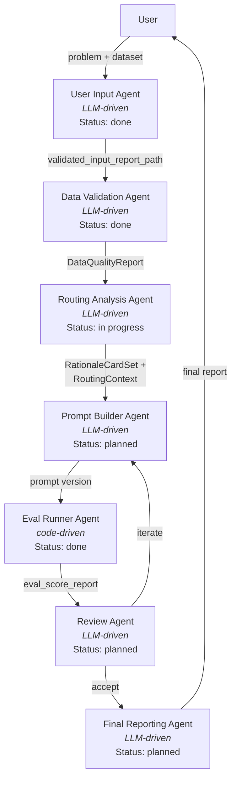

# Architecture Map

Quick re-orientation guide for the Odysseus multi-agent routing optimizer.

## 1. Pipeline Overview

## 2. Agent Registry

| Agent | Type | Module / Prompt | Status | Reads from Context | Writes to Context |
|---|---|---|---|---|---|
| User Input | LLM-driven | [`odysseus/agents/prompts/user_input_system.md`](../odysseus/agents/prompts/user_input_system.md), [`odysseus/agents/user_input_report.py`](../odysseus/agents/user_input_report.py) | Done | (user conversation) | `validated_input_report_path` |
| Data Validation | LLM-driven | [`odysseus/agents/prompts/data_validation_system.md`](../odysseus/agents/prompts/data_validation_system.md), [`odysseus/agents/data_validation_checks.py`](../odysseus/agents/data_validation_checks.py) | Done | `validated_input_report_path` | `DataQualityReport` (via tool return) |
| Routing Analysis | LLM-driven | [`odysseus/agents/routing_rationale_models.py`](../odysseus/agents/routing_rationale_models.py), [`odysseus/agents/routing_rationale_checks.py`](../odysseus/agents/routing_rationale_checks.py), [`odysseus/agents/routing_rationale_registry.py`](../odysseus/agents/routing_rationale_registry.py), [`odysseus/agents/stratified_split.py`](../odysseus/agents/stratified_split.py) | In progress | `DataQualityReport`, dataset rows | `RationaleCardSet`, `dev.jsonl`, `holdout.jsonl`, `split_report.json` |
| Eval Runner | Code-driven | [`odysseus/agents/eval_runner.py`](../odysseus/agents/eval_runner.py), [`odysseus/agents/prompts/eval_runner_system.md`](../odysseus/agents/prompts/eval_runner_system.md) | Done | `prompt_version`, `data_source`, `backend`, `config_path` | `eval_score_report` |
| Prompt Builder | LLM-driven | (planned) | Planned | `RationaleCardSet`, `RoutingContext` | `prompt_version` |
| Review | LLM-driven | (planned) | Planned | `eval_score_report` | iterate/accept decision |
| Final Reporting | LLM-driven | (planned) | Planned | `eval_score_report`, full pipeline context | final report |

## 3. Context Dict Reference

| Key | Type | Set By | Consumed By | Description |
|---|---|---|---|---|
| `validated_input_report_path` | `str` | User Input Agent | Data Validation Agent | Filesystem path to the Markdown input report |
| `eval_score_report` | `ScoreReport` | Eval Runner Agent | Review Agent | Metrics, summary, error breakdown, and run-over-run diff |
| `prompt_version` | `str` | Prompt Builder Agent / MCP tool param | Eval Runner Agent | Prompt version identifier (e.g. `"v3"`, `"latest"`) |
| `data_source` | `str` | MCP tool param | Eval Runner Agent, Data Validation Agent | Path to the JSONL dataset file |
| `backend` | `str` | MCP tool param | Eval Runner Agent | Backend label matching a profile in `backends/` |
| `config_path` | `str` | MCP tool param | Eval Runner Agent | Path to YAML run config (default `outputs/run_config.yaml`) |
| `routing_context` | `RoutingContext` | Data Validation Agent | Routing Analysis Agent | Domain-agnostic routing config: routes, dimensions, ordering, seed vocabulary |

## 4. Shared Models

**`DataQualityReport`** ([`odysseus/agents/data_validation_checks.py`](../odysseus/agents/data_validation_checks.py))
Top-level report from the Data Validation agent containing `SchemaFinding` list, `LabelDistribution`, `VolumeAssessment`, and optional `QueryLengthDistribution`. The LLM agent writes the narrative `summary`; the Python checks populate the structured sections.

**`RationaleCardSet` / `RationaleCard`** ([`odysseus/agents/routing_rationale_models.py`](../odysseus/agents/routing_rationale_models.py))
A `RationaleCardSet` maps `example_id` to `RationaleCard` and bundles a `VocabularyRegistry` plus dataset hash. Each `RationaleCard` captures `assigned_route`, `intent_pattern` (kebab-case), `complexity_structure` (kebab-case), `route_exclusions` (list of `RouteExclusion`), and `ambiguity_tags` (SCREAMING_SNAKE_CASE).

**`VocabularyRegistry`** ([`odysseus/agents/routing_rationale_models.py`](../odysseus/agents/routing_rationale_models.py))
Dynamic registry of `VocabularyEntry` items across three dimensions: `intent_pattern`, `complexity_structure`, and `ambiguity_tags`. Naming conventions are enforced by cross-field validators. Registry persistence and merge/prune operations live in [`routing_rationale_registry.py`](../odysseus/agents/routing_rationale_registry.py).

**`RoutingContext`** ([`odysseus/agents/routing_rationale_models.py`](../odysseus/agents/routing_rationale_models.py))
Domain-agnostic routing configuration holding a `domain` description, `RouteDefinition` list, `RoutingDimension` list, optional `RouteOrdering`, and optional `SeedVocabulary`. Produced by the Data Validation Agent and consumed by the Routing Analysis Agent to scope annotation.

**`ScoreReport` / `RunReport`** ([`odysseus/eval/models.py`](../odysseus/eval/models.py))
`RunReport` is the full evaluation output (config, metrics, results, summary). `ScoreReport` is the inter-agent contract (context key `eval_score_report`) containing metrics, summary, error breakdown, run-over-run `RunDiff`, and output file paths.

## 5. MCP Surface

### Tools

| Name | Status | Purpose | Backing Module |
|---|---|---|---|
| `optimize_routing_prompt` | Stub | Run the full routing prompt optimization pipeline | [`odysseus/mcp.py`](../odysseus/mcp.py) |
| `run_eval` | Implemented | Run an evaluation of a prompt version against a dataset (dev split) | [`odysseus/agents/eval_runner.py`](../odysseus/agents/eval_runner.py) |
| `run_holdout_eval` | Stub | Run evaluation on the holdout split (Final Evaluation agent only) | [`odysseus/mcp.py`](../odysseus/mcp.py) |
| `submit_input_report` | Stub | Submit a validated input report to the pipeline | [`odysseus/mcp.py`](../odysseus/mcp.py) |
| `validate_dataset` | Implemented | Run all validation checks against a JSONL routing dataset | [`odysseus/agents/data_validation_checks.py`](../odysseus/agents/data_validation_checks.py) |

### Prompts

| Name | Purpose | Backing File |
|---|---|---|
| `odysseus_routing_input` | Activate the User Input agent conversation | [`odysseus/agents/prompts/user_input_system.md`](../odysseus/agents/prompts/user_input_system.md) |
| `odysseus_data_validation` | Activate the Data Validation agent conversation | [`odysseus/agents/prompts/data_validation_system.md`](../odysseus/agents/prompts/data_validation_system.md) |

### Resources

| URI | Purpose | Backing File |
|---|---|---|
| `odysseus://agents/input/clarification-guide` | Per-field clarification guidance for the input agent | [`odysseus/agents/user_input_clarification_guide.md`](../odysseus/agents/user_input_clarification_guide.md) |
| `odysseus://agents/input/defaults` | Default values and override mechanism for optional fields | [`odysseus/agents/user_input_defaults.md`](../odysseus/agents/user_input_defaults.md) |
| `odysseus://agents/data-validation/format-spec` | Data format specification (THP-80) | [`odysseus/agents/data_validation_format.md`](../odysseus/agents/data_validation_format.md) |
| `odysseus://agents/data-validation/output-spec` | Output format specification (THP-81) | [`odysseus/agents/data_validation_output.md`](../odysseus/agents/data_validation_output.md) |

## 6. Directory Guide

| Directory | Description |
|---|---|
| `odysseus/` | Main Python package: MCP server, agents, eval engine, prompt manager |
| `odysseus/agents/` | Agent implementations, domain models, validation logic, and registry operations |
| `odysseus/agents/prompts/` | Agent system prompts (Markdown) surfaced via MCP |
| `odysseus/eval/` | Evaluation engine: controller, backends, metrics, dataset loading, result collection ([README](../odysseus/eval/README.md)) |
| `prompts/` | Versioned routing prompt store (consumed by `FilePromptManager`) |
| `data/` | Dataset files (JSONL) |
| `outputs/` | Run outputs, reports, and config files |
| `configs/` | Project configuration files |
| `tests/` | Test suite (`pytest`) |
| `tests/scenarios/` | MCP integration test scenarios ([README](../tests/scenarios/README.md)) |
| `tests/fixtures/integration/` | Eval runner integration fixtures ([README](../tests/fixtures/integration/README.md)) |
| `docs/` | Project documentation and specs |
| `_analysis/` | Ad-hoc analysis artifacts |
