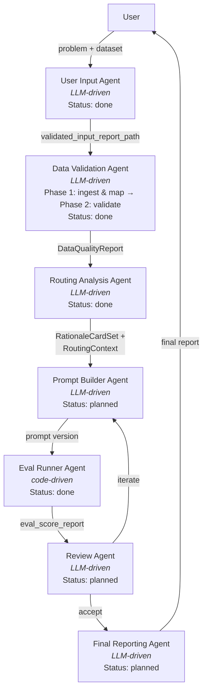

# Architecture Map

Quick re-orientation guide for the Odysseus multi-agent routing optimizer.

## 1. Pipeline Overview



## 2. Agent Registry

| Agent | Type | Module / Prompt | Status | Reads from Context | Writes to Context |
|---|---|---|---|---|---|
| User Input | LLM-driven | [`odysseus/agents/prompts/user_input_system.md`](../odysseus/agents/prompts/user_input_system.md), [`odysseus/agents/user_input_report.py`](../odysseus/agents/user_input_report.py) | Done | (user conversation) | `validated_input_report_path` |
| Data Validation | LLM-driven | [`odysseus/agents/prompts/data_validation_system.md`](../odysseus/agents/prompts/data_validation_system.md), [`odysseus/agents/data_validation_checks.py`](../odysseus/agents/data_validation_checks.py) | Done | `validated_input_report_path` | `data_quality_report`, `routing_context`, `dataset_path`, `original_dataset_path` |
| Routing Analysis | LLM-driven | [`odysseus/agents/routing_rationale_models.py`](../odysseus/agents/routing_rationale_models.py), [`odysseus/agents/routing_rationale_checks.py`](../odysseus/agents/routing_rationale_checks.py), [`odysseus/agents/routing_rationale_registry.py`](../odysseus/agents/routing_rationale_registry.py), [`odysseus/agents/stratified_split.py`](../odysseus/agents/stratified_split.py) | Done | `validated_input_report_path`, `data_quality_report`, `routing_context`, `dataset_path` | `dev_rationale_card_set_path`, `dev_jsonl_path`, `vocabulary_registry_path`, `split_report_path`, `routing_context` (passthrough), `holdout_rationale_card_set_path`, `holdout_jsonl_path` |
| Eval Runner | Code-driven | [`odysseus/agents/eval_runner.py`](../odysseus/agents/eval_runner.py), [`odysseus/agents/prompts/eval_runner_system.md`](../odysseus/agents/prompts/eval_runner_system.md) | Done | `prompt_version`, `data_source`, `backend`, `config_path` | `eval_score_report` |
| Backend Setup | LLM-driven | [`odysseus/agents/prompts/backend_setup_system.md`](../odysseus/agents/prompts/backend_setup_system.md) | Done | (user conversation) | `backend` (new YAML file written to `backends/`) |
| Prompt Builder | LLM-driven | (planned) | Planned | `RationaleCardSet`, `RoutingContext` | `prompt_version` |
| Review | Hybrid (code + LLM) | [`odysseus/agents/review_models.py`](../odysseus/agents/review_models.py), [`odysseus/agents/review_preprocessor.py`](../odysseus/agents/review_preprocessor.py), [`odysseus/agents/review_ops.py`](../odysseus/agents/review_ops.py), [`odysseus/agents/prompts/review_agent_system.md`](../odysseus/agents/prompts/review_agent_system.md) | Done | `eval_score_report`, `review_briefing` | `review_result` |
| Final Reporting | LLM-driven | (planned) | Planned | `eval_score_report`, full pipeline context | final report |

## 3. Context Dict Reference

| Key | Type | Set By | Consumed By | Description |
|---|---|---|---|---|
| `validated_input_report_path` | `str` | User Input Agent | Data Validation Agent | Filesystem path to the Markdown input report |
| `eval_score_report` | `ScoreReport` | Eval Runner Agent | Review Agent | Metrics, summary, error breakdown, and run-over-run diff |
| `prompt_version` | `str` | Prompt Builder Agent / MCP tool param | Eval Runner Agent | Prompt version identifier (e.g. `"v3"`, `"latest"`) |
| `data_source` | `str` | MCP tool param | Eval Runner Agent, Data Validation Agent | Path to the JSONL dataset file |
| `backend` | `str` | MCP tool param | Eval Runner Agent | Backend label matching a profile in `backends/` |
| `config_path` | `str` | MCP tool param | Eval Runner Agent | Path to YAML run config (default `outputs/run_config.yaml`) |
| `routing_context` | `RoutingContext` | Data Validation Agent | Routing Analysis Agent | Domain-agnostic routing config: routes, dimensions, ordering, seed vocabulary |
| `data_quality_report` | `DataQualityReport` | Data Validation Agent | Routing Analysis Agent | Schema findings, label distribution, volume assessment |
| `dataset_path` | `str` | Data Validation Agent | Routing Analysis Agent | Path to validated JSONL dataset |
| `original_dataset_path` | `str` | Data Validation Agent | (provenance tracking) | Path to the user's original dataset file before transformation |
| `dev_rationale_card_set_path` | `str` | Routing Analysis Agent | Prompt Builder Agent | Cards for dev examples only |
| `dev_jsonl_path` | `str` | Routing Analysis Agent | Prompt Builder Agent | Dev split examples path |
| `vocabulary_registry_path` | `str` | Routing Analysis Agent | Prompt Builder Agent | Full vocabulary registry path |
| `split_report_path` | `str` | Routing Analysis Agent | Prompt Builder Agent | Split statistics and distribution report |
| `holdout_rationale_card_set_path` | `str` | Routing Analysis Agent | Final Reporting Agent | Cards for holdout examples only |
| `holdout_jsonl_path` | `str` | Routing Analysis Agent | Final Reporting Agent | Holdout split examples path |
| `review_briefing` | `ReviewBriefing` | Review Agent (pre-processor) | Review Agent (LLM) | Pre-processed round data: candidate analyses, per-class recall, diversity metrics, mutation history, oracle metrics |
| `review_result` | `ReviewResult` | Review Agent (LLM) | Prompt Builder Agent | Ranked candidates, edit directives, promotion decisions, loop signal, regression guards |

## 4. Shared Models

**`DataQualityReport`** ([`odysseus/agents/data_validation_checks.py`](../odysseus/agents/data_validation_checks.py))
Top-level report from the Data Validation agent containing `SchemaFinding` list, `LabelDistribution`, `VolumeAssessment`, and optional `QueryLengthDistribution`. The LLM agent writes the narrative `summary`; the Python checks populate the structured sections.

**`RationaleCardSet` / `RationaleCard`** ([`odysseus/agents/routing_rationale_models.py`](../odysseus/agents/routing_rationale_models.py))
A `RationaleCardSet` maps `example_id` to `RationaleCard` and bundles a `VocabularyRegistry` plus dataset hash. Each `RationaleCard` captures `assigned_route`, `intent_pattern` (kebab-case), `complexity_structure` (kebab-case), `route_exclusions` (list of `RouteExclusion`), and `ambiguity_tags` (SCREAMING_SNAKE_CASE).

**`VocabularyRegistry`** ([`odysseus/agents/routing_rationale_models.py`](../odysseus/agents/routing_rationale_models.py))
Dynamic registry of `VocabularyEntry` items across three dimensions: `intent_pattern`, `complexity_structure`, and `ambiguity_tags`. Naming conventions are enforced by cross-field validators. Registry persistence and merge/prune operations live in [`routing_rationale_registry.py`](../odysseus/agents/routing_rationale_registry.py).

**`RoutingContext`** ([`odysseus/agents/routing_rationale_models.py`](../odysseus/agents/routing_rationale_models.py))
Domain-agnostic routing configuration holding a `domain` description, `RouteDefinition` list, `RoutingDimension` list, optional `RouteOrdering`, and optional `SeedVocabulary`. Produced by the Data Validation Agent and consumed by the Routing Analysis Agent to scope annotation.

**`ReviewBriefing` / `ReviewResult`** ([`odysseus/agents/review_models.py`](../odysseus/agents/review_models.py))
`ReviewBriefing` is the complete pre-processed input for the Review Agent LLM, containing `CandidateAnalysis` list, `DiversityMetrics`, `DiminishingReturns`, `MutationHistory`, `OracleMetrics`, per-class recall, and holdout example summaries. `ReviewResult` is the LLM output: `candidate_ranking`, `edit_directives`, `promotion_decisions`, `loop_signal`, `regression_guards`, and `directive_history_update`. Persistence (directive history, mutation log, round reports) lives in [`review_ops.py`](../odysseus/agents/review_ops.py).

**`ScoreReport` / `RunReport`** ([`odysseus/eval/models.py`](../odysseus/eval/models.py))
`RunReport` is the full evaluation output (config, metrics, results, summary). `ScoreReport` is the inter-agent contract (context key `eval_score_report`) containing metrics, summary, error breakdown, run-over-run `RunDiff`, and output file paths.

**`BackendProfile`** ([`odysseus/eval/backends/profile.py`](../odysseus/eval/backends/profile.py))
Pydantic model representing a validated backend configuration loaded from a YAML file in `backends/`. Key fields:

| Field | Type | Description |
|-------|------|-------------|
| `provider` | `Literal["anthropic", "openai", "bedrock", "mock_echo"]` | SDK backend selector |
| `model` | `str` | Model identifier (e.g. `"claude-sonnet-4-20250514"`) |
| `requests_per_minute` | `int` | RPM rate limit cap |
| `tokens_per_minute` | `int` | TPM rate limit cap |
| `max_tokens` | `int \| None` | Max tokens to generate |
| `temperature` | `float \| None` | Sampling temperature |
| `reasoning_level` | `Literal["low", "medium", "high"] \| None` | Reasoning effort/budget tier; mapped per-provider (Anthropic: `thinking.budget_tokens`, OpenAI: `reasoning_effort`) |
| `pricing` | `ModelPricing \| None` | Inline cost config for token-based cost tracking |
| `api_key_env` | `str \| None` | Env var name holding the API key |
| `extra_params` | `dict[str, Any]` | Additional kwargs splatted into the provider SDK's `create()` call |
| `provider_params` | `dict[str, Any]` | Provider-specific kwargs for client construction |

## 5. MCP Surface

### Tools

| Name | Status | Purpose | Backing Module |
|---|---|---|---|
| `optimize_routing_prompt` | Stub | Run the full routing prompt optimization pipeline | [`odysseus/mcp.py`](../odysseus/mcp.py) |
| `run_eval` | Implemented | Run an evaluation of a prompt version against a dataset (dev split) | [`odysseus/agents/eval_runner.py`](../odysseus/agents/eval_runner.py) |
| `run_holdout_eval` | Stub | Run evaluation on the holdout split (Final Evaluation agent only) | [`odysseus/mcp.py`](../odysseus/mcp.py) |
| `submit_input_report` | Stub | Submit a validated input report to the pipeline | [`odysseus/mcp.py`](../odysseus/mcp.py) |
| `validate_dataset` | Implemented | Run all validation checks against a JSONL routing dataset | [`odysseus/agents/data_validation_checks.py`](../odysseus/agents/data_validation_checks.py) |
| `create_seed_registry` | Implemented | Initialize vocabulary registry with canonical ambiguity tags | [`odysseus/agents/routing_rationale_registry.py`](../odysseus/agents/routing_rationale_registry.py) |
| `resolve_registry` | Implemented | Look up existing registry by dataset hash | [`odysseus/agents/routing_rationale_registry.py`](../odysseus/agents/routing_rationale_registry.py) |
| `validate_rationale_card_set` | Implemented | Run deterministic validation checks on card set | [`odysseus/agents/routing_rationale_checks.py`](../odysseus/agents/routing_rationale_checks.py) |
| `prune_registry` | Implemented | Remove entries below cluster threshold | [`odysseus/agents/routing_rationale_registry.py`](../odysseus/agents/routing_rationale_registry.py) |
| `stratified_split` | Implemented | Split dataset + card set into dev/holdout | [`odysseus/agents/stratified_split.py`](../odysseus/agents/stratified_split.py) |
| `build_review_briefing_tool` | Planned | Pre-process a round's candidates into a ReviewBriefing for the Review Agent | [`odysseus/agents/review_preprocessor.py`](../odysseus/agents/review_preprocessor.py) |
| `record_directive_outcomes_tool` | Planned | Persist directive outcome tracking after the Review Agent emits a ReviewResult | [`odysseus/agents/review_ops.py`](../odysseus/agents/review_ops.py) |

### Prompts

| Name | Purpose | Backing File |
|---|---|---|
| `odysseus_routing_input` | Activate the User Input agent conversation | [`odysseus/agents/prompts/user_input_system.md`](../odysseus/agents/prompts/user_input_system.md) |
| `odysseus_data_validation` | Activate the Data Validation agent conversation | [`odysseus/agents/prompts/data_validation_system.md`](../odysseus/agents/prompts/data_validation_system.md) |
| `odysseus_routing_analysis` | Routing Analysis Agent system prompt | [`odysseus/agents/prompts/routing_analysis_system.md`](../odysseus/agents/prompts/routing_analysis_system.md) |
| `odysseus_review_agent` | Review Agent system prompt — receives ReviewBriefing, emits ReviewResult JSON | [`odysseus/agents/prompts/review_agent_system.md`](../odysseus/agents/prompts/review_agent_system.md) |
| `odysseus_backend_setup` | Backend setup agent — select or create backend | [`odysseus/agents/prompts/backend_setup_system.md`](../odysseus/agents/prompts/backend_setup_system.md) |

### Resources

| URI | Purpose | Backing File |
|---|---|---|
| `odysseus://backends/{backend_label}` | Backend profile YAML (resource template) — provider detection for prompt builder | `backends/{backend_label}.yaml` (user project dir) |
| `odysseus://agents/prompt-builder/best-practices` | General prompt engineering principles for routing prompts | [`odysseus/agents/prompt_builder_best_practices.md`](../odysseus/agents/prompt_builder_best_practices.md) |
| `odysseus://agents/prompt-builder/conventions-claude` | Claude conventions and Anthropic cookbook patterns for routing prompts | [`odysseus/agents/prompt_builder_conventions_claude.md`](../odysseus/agents/prompt_builder_conventions_claude.md) |
| `odysseus://agents/prompt-builder/conventions-openai` | OpenAI GPT-5 conventions and cookbook patterns for routing prompts | [`odysseus/agents/prompt_builder_conventions_openai.md`](../odysseus/agents/prompt_builder_conventions_openai.md) |
| `odysseus://agents/prompt-builder/conventions-{provider}/{model_family}` | Model-specific conventions addendum (resource template) — returns empty if no addendum exists | `odysseus/agents/prompt_builder_conventions_{provider}_{model_family}.md` |
| `odysseus://agents/input/clarification-skill` | Structured clarification skill — conversational strategy for the input agent | [`odysseus/agents/skills/structured-clarification.md`](../odysseus/agents/skills/structured-clarification.md) |
| `odysseus://agents/input/defaults` | Default values and override mechanism for optional fields | [`odysseus/agents/user_input_defaults.md`](../odysseus/agents/user_input_defaults.md) |
| `odysseus://agents/data-validation/format-spec` | Data format specification (THP-80) | [`odysseus/agents/data_validation_format.md`](../odysseus/agents/data_validation_format.md) |
| `odysseus://agents/data-validation/output-spec` | Output format specification (THP-81) | [`odysseus/agents/data_validation_output.md`](../odysseus/agents/data_validation_output.md) |
| `odysseus://agents/routing-analysis/classify-example-skill` | Classify-example skill for annotation | [`odysseus/skills/classify-example/SKILL.md`](../odysseus/skills/classify-example/SKILL.md) |
| `odysseus://agents/routing-analysis/generate-rationale-skill` | Generate-routing-rationale skill for annotation | [`odysseus/skills/generate-routing-rationale/SKILL.md`](../odysseus/skills/generate-routing-rationale/SKILL.md) |
| `odysseus://agents/routing-analysis/check-overlap-skill` | Check-semantic-overlap skill for validation | [`odysseus/skills/check-semantic-overlap/SKILL.md`](../odysseus/skills/check-semantic-overlap/SKILL.md) |
| `odysseus://agents/review-agent/guidelines` | Review Agent operational guidelines — scoring criteria, promotion rules, loop exit heuristics | [`odysseus/agents/prompts/review_agent_system.md`](../odysseus/agents/prompts/review_agent_system.md) |
| `odysseus://agents/backend-setup/clarification-skill` | Structured clarification skill for backend setup | [`odysseus/agents/skills/structured-clarification.md`](../odysseus/agents/skills/structured-clarification.md) |
| `odysseus://agents/backend-setup/taxonomy` | Backend field taxonomy (blocking/non-blocking) | [`odysseus/agents/backend_setup_taxonomy.md`](../odysseus/agents/backend_setup_taxonomy.md) |
| `odysseus://agents/backend-setup/defaults` | Backend defaults and pricing resolution | [`odysseus/agents/backend_setup_defaults.md`](../odysseus/agents/backend_setup_defaults.md) |

## 6. Directory Guide

| Directory | Description |
|---|---|
| `odysseus/` | Main Python package: MCP server, agents, eval engine, prompt manager |
| `odysseus/agents/` | Agent implementations, domain models, validation logic, and registry operations |
| `odysseus/agents/prompts/` | Agent system prompts (Markdown) surfaced via MCP |
| `odysseus/eval/` | Evaluation engine: controller, backends, metrics, dataset loading, result collection ([README](../odysseus/eval/README.md)) |
| `prompts/` | Versioned routing prompt store (consumed by `FilePromptManager`) |
| `data/` | Dataset files (JSONL) |
| `outputs/` | Run outputs, reports, and config files |
| `configs/` | Project configuration files |
| `tests/` | Test suite (`pytest`) |
| `tests/scenarios/` | MCP integration test scenarios ([README](../tests/scenarios/README.md)) |
| `tests/fixtures/integration/` | Eval runner integration fixtures ([README](../tests/fixtures/integration/README.md)) |
| `docs/` | Project documentation and specs |
| `_analysis/` | Ad-hoc analysis artifacts |

## 7. Installation (External Users)

Add to your project's `.mcp.json`:
```json
{
  "mcpServers": {
    "odysseus": {
      "command": "uvx",
      "args": ["--from", "git+https://github.com/<owner>/project-odysseus", "odysseus"]
    }
  }
}
```

Then initialize your project:
```bash
odysseus init
```

This creates `outputs/`, `prompts/`, and `backends/` with starter files.

All file I/O (`outputs/`, `prompts/`, `backends/`) resolves against the current working directory. To control where files are written, set the working directory when launching the server:
```json
{
  "mcpServers": {
    "odysseus": {
      "command": "uvx",
      "args": ["--from", "git+https://github.com/<owner>/project-odysseus", "odysseus"],
      "cwd": "/path/to/your/project"
    }
  }
}
```
