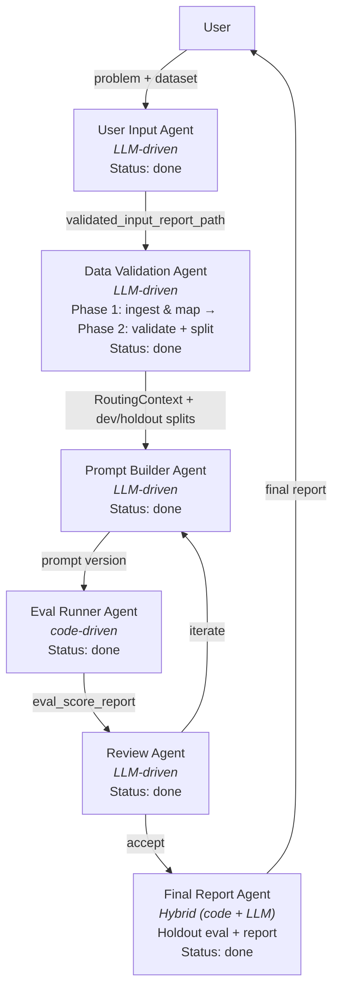

# Architecture Map

Quick re-orientation guide for the Odysseus multi-agent routing optimizer.

## 1. Pipeline Overview



**Rerun mode:** When Stage 4 has converged, the orchestrator can call `initiate_rerun` to re-enter the pipeline at Stage 3 for a different backend. The rerun flow is: Stage 3 (new backend) → Stage 4 (Prompt Builder Rerun: format restructure + single eval) → Stage 5 (final report). The original search state is preserved as `search_state_original.json`; `rerun_config.json` drives rerun-mode behavior throughout `status.py`.

## 2. Agent Registry

| Agent | Type | Module / Prompt | Status | Reads from Context | Writes to Context |
|---|---|---|---|---|---|
| User Input | LLM-driven | [`odysseus/agents/prompts/user_input_system.md`](../odysseus/agents/prompts/user_input_system.md), [`odysseus/agents/user_input/report.py`](../odysseus/agents/user_input/report.py) | Done | (user conversation) | `validated_input_report_path` |
| Data Validation | LLM-driven | [`odysseus/agents/prompts/data_validation_system.md`](../odysseus/agents/prompts/data_validation_system.md), [`odysseus/agents/data_validation/checks.py`](../odysseus/agents/data_validation/checks.py), [`odysseus/agents/data_validation/split.py`](../odysseus/agents/data_validation/split.py) | Done | `validated_input_report_path` | `data_quality_report`, `routing_context`, `dataset_path`, `original_dataset_path`, `dev_jsonl_path`, `holdout_jsonl_path`, `split_report_path` |
| Eval Runner | Code-driven | [`odysseus/agents/eval_runner.py`](../odysseus/agents/eval_runner.py), [`odysseus/agents/prompts/eval_runner_system.md`](../odysseus/agents/prompts/eval_runner_system.md) | Done | `prompt_version`, `data_source`, `backend`, `run_config` or `config_path` | `eval_score_report` |
| Backend Setup | LLM-driven | [`odysseus/agents/prompts/backend_setup_system.md`](../odysseus/agents/prompts/backend_setup_system.md) | Done | (user conversation) | `backend` (new YAML file written to `backends/`) |
| Prompt Builder | LLM-driven | (planned) | Planned | `routing_context`, `dev_jsonl_path` | `prompt_version` |
| Prompt Builder Rerun | LLM-driven | [`odysseus/agents/prompts/prompt_builder_rerun_system.md`](../odysseus/agents/prompts/prompt_builder_rerun_system.md) | Done | `run_id`, `source_prompt_version`, `new_backend` (from subagent instruction) | `prompt_version` (restructured) |
| Review | Hybrid (code + LLM) | [`odysseus/agents/review/models.py`](../odysseus/agents/review/models.py), [`odysseus/agents/review/preprocessor.py`](../odysseus/agents/review/preprocessor.py), [`odysseus/agents/review/ops.py`](../odysseus/agents/review/ops.py), three-tier prompt: `review_agent_base_system.md` + phase base + strategy overlay (see Prompts table) | Done | `eval_score_report`, `review_briefing` | `review_result` |
| Final Report | Hybrid (code + LLM) | [`odysseus/agents/final_report/models.py`](../odysseus/agents/final_report/models.py), [`odysseus/agents/final_report/preprocessor.py`](../odysseus/agents/final_report/preprocessor.py), [`odysseus/agents/prompts/final_report_system.md`](../odysseus/agents/prompts/final_report_system.md), [`odysseus/agents/prompts/final_report_template.md`](../odysseus/agents/prompts/final_report_template.md) | Done | holdout dataset, search state, all eval reports | `final_report.md`, `baseline_comparison.json`, optimization charts |

## 3. Context Dict Reference

> **Run scoping:** All pipeline artifacts are scoped to a `run_id` generated by `submit_input_report`. Context keys below correspond to files persisted under `outputs/<run_id>/`. The `run_id` is passed explicitly to all MCP tools.

| Key | Type | Set By | Consumed By | Description |
|---|---|---|---|---|
| `validated_input_report_path` | `str` | User Input Agent | Data Validation Agent | Filesystem path to the Markdown input report |
| `eval_score_report` | `ScoreReport` | Eval Runner Agent | Review Agent | Metrics, summary, error breakdown, and run-over-run diff |
| `prompt_version` | `str` | Prompt Builder Agent / MCP tool param | Eval Runner Agent | Prompt version identifier (e.g. `"v3"`, `"latest"`) |
| `data_source` | `str` | MCP tool param | Eval Runner Agent, Data Validation Agent | Path to the JSONL dataset file |
| `backend` | `str` | MCP tool param | Eval Runner Agent | Backend label matching a profile in `backends/` |
| `config_path` | `str` | MCP tool param | Eval Runner Agent | Path to YAML run config (default `outputs/run_config.yaml`) |
| `routing_context` | `RoutingContext` | Data Validation Agent | Prompt Builder Agent | Domain-agnostic routing config: routes, dimensions, ordering, seed vocabulary |
| `data_quality_report` | `DataQualityReport` | Data Validation Agent | (diagnostics) | Schema findings, label distribution, volume assessment |
| `dataset_path` | `str` | Data Validation Agent | (provenance tracking) | Path to validated JSONL dataset before splitting |
| `original_dataset_path` | `str` | Data Validation Agent | (provenance tracking) | Path to the user's original dataset file before transformation |
| `dev_jsonl_path` | `str` | Data Validation Agent | Prompt Builder Agent | Dev split examples path |
| `holdout_jsonl_path` | `str` | Data Validation Agent | Final Reporting Agent | Holdout split examples path |
| `split_report_path` | `str` | Data Validation Agent | Prompt Builder Agent | Split statistics and distribution report |
| `review_briefing` | `ReviewBriefing` | Review Agent (pre-processor) | Review Agent (LLM) | Pre-processed round data: candidate analyses, per-class recall, diversity metrics, mutation history, oracle metrics |
| `review_result` | `ReviewResult` | Review Agent (LLM) | Prompt Builder Agent | Ranked candidates, edit directives, promotion decisions, loop signal, regression guards |

## 4. Shared Models

**`Candidate` / `SearchState` / `RoundSummary`** ([`odysseus/agents/prompt_builder/search.py`](../odysseus/agents/prompt_builder/search.py))
`Candidate` is the canonical prompt-candidate record. Core fields: `prompt_version`, `parent_version`, `quality_score`, `cost`, `round_introduced`, `example_ids`. Optional fields (all default `None`): `secondary_parent_version`, `eval_status` (parallel eval tracking), `mutation_strategy`, `route_metrics`, `trajectory_id`. Accepts `iteration_introduced` as an alias for `round_introduced` (back-compat). Old state files carrying `dominated` load without error (`extra="ignore"`).

`SearchState` holds the mutable search loop state. Key fields:

| Field | Type | Description |
|---|---|---|
| `elite_set` | `list[Candidate]` | Current non-dominated candidate set (formerly `pareto_front`; old files with `pareto_front` key are migrated on load) |
| `algorithm` | `str` | Discriminator set from `_BRANCH_ALGORITHM` at `init_search_state` time; trunk default is `"__unset__"`, leaf branches set a concrete value (e.g. `"hill_climb"`) |
| `algorithm_state` | `dict[str, Any]` | Strategy-specific sub-state pocket; hardcoded per branch via `_BRANCH_ALGORITHM_STATE` in `search_ops.py` (empty `{}` on trunk) |
| `round`, `stagnation_count`, `mutation_mode` | — | Bookkeeping fields (semantics may vary by algorithm) |
| `converged`, `loop_phase` | — | Convergence flag and current sub-phase; base phases on trunk: `"build"`, `"review"`, `"build_recovering"`; leaf branches extend with algorithm-specific phases (e.g. `"calibration"`, `"warmup_seed"`, `"warmup_build"`, `"warmup_reduce"`) |
| `active_evals` | `list[str]` | Prompt versions currently being evaluated (pending or running). Invariant: non-empty iff `loop_phase == "build"` and a concurrent batch eval was interrupted. `_detect_stage_4_phase` returns `"build_recovering"` when this field is non-empty. |

`RoundSummary` is the per-round progress record. Field names follow the unified cross-branch schema:

| Canonical field | Renamed from | Strategy |
|---|---|---|
| `new_elite_entries` | `new_pareto_points` (main) | all |
| `elite_size` | `front_size` (main) | all |
| `target_improvement` | `front_improvement` (main) | all |
| `mutation_mode`, `stagnation_count` | — (main only) | optional (hill-climb) |

Old state files with `new_pareto_points` / `front_size` / `front_improvement` are migrated on load via a `model_validator(mode="before")`.

**`DataQualityReport`** ([`odysseus/agents/data_validation/checks.py`](../odysseus/agents/data_validation/checks.py))
Top-level report from the Data Validation agent containing `SchemaFinding` list, `LabelDistribution`, `VolumeAssessment`, and optional `QueryLengthDistribution`. The LLM agent writes the narrative `summary`; the Python checks populate the structured sections.

**`RoutingContext`** ([`odysseus/agents/routing_context.py`](../odysseus/agents/routing_context.py))
Domain-agnostic routing configuration holding a `domain` description, `RouteDefinition` list, `RoutingDimension` list, optional `RouteOrdering`, and optional `SeedVocabulary`. Produced by the Data Validation Agent and consumed by the Prompt Builder Agent.

**`ReviewBriefing` / `ReviewResult`** ([`odysseus/agents/review/models.py`](../odysseus/agents/review/models.py))
`ReviewBriefing` is the complete pre-processed input for the Review Agent LLM, containing `CandidateAnalysis` list, `DiversityMetrics`, `DiminishingReturns`, `OracleMetrics`, per-class recall, `UserTargetProgress` list (progress toward user-specified metric targets; each entry carries `source_version` — the single candidate version evaluated, all entries sharing the same value), `single_candidate_meets_all` flag (`true` when every target is met by the same candidate — the only safe condition for `LoopSignal{action="exit"}`), `BatchOutcome` list (linking child variants to their eval results), `directive_history` list (`DirectiveOutcome` entries for prior-round directives — synthesized wholly in code by `_synthesize_directive_outcomes` inside `build_review_briefing` from `batch_outcomes`; no `directive_history.json` file is persisted and the agent no longer writes outcomes), `ChildVariant` list, and `initial_parent_version` (canonical `parent_version` for cold-start / warm-up seeds; default `"base"`). `ReviewResult` is the LLM output: `candidate_ranking`, `child_variants`, `promotion_decisions`, `loop_signal`, and `regression_guards`. Persistence (child variants, round reports) lives in [`review/ops.py`](../odysseus/agents/review/ops.py). Child variants are persisted to `child_variants.json` via `record_directive_outcomes_tool` and retrieved by the Prompt Builder via `get_child_variants_tool`. `get_edit_directives_tool` is a back-compat helper that flattens all directives across variants into a single list.

Strategy-specific optional fields pre-provisioned as `None`-default slots in the model; each leaf branch's preprocessor function populates the slots relevant to its algorithm:

| Field | Type | Algorithm | Populated by |
|---|---|---|---|
| `parent_a_version`, `parent_b_version` | `str \| None` | all | `build_review_briefing` |
| `trajectory_id` | `int \| None` | EMOSA | `_populate_emosa_review_fields` (leaf branch) |
| `weight_vector` | `tuple[float, float] \| None` | EMOSA | `_populate_emosa_review_fields` (leaf branch) |
| `binding_axis` | `"quality" \| "cost" \| None` | EMOSA | `_populate_emosa_review_fields` (leaf branch) |
| `acceptance_history` | `list[bool] \| None` | EMOSA | `_populate_emosa_review_fields` (leaf branch) |
| `stagnation_signal` | `dict \| None` | all | algorithm-specific `_populate_*_review_fields` on the leaf branch |

Algorithm-specific advance logic (e.g. EMOSA steady-state advance, beam step) lives entirely on the leaf branches' `search_ops.py`.

**`ScoreReport` / `RunReport`** ([`odysseus/eval/models.py`](../odysseus/eval/models.py))
`RunReport` is the full evaluation output (config, metrics, results, summary). `ScoreReport` is the inter-agent contract (context key `eval_score_report`) containing metrics, summary, error breakdown, run-over-run `RunDiff`, and output file paths.

**`BackendProfile`** ([`odysseus/eval/backends/profile.py`](../odysseus/eval/backends/profile.py))
Pydantic model representing a validated backend configuration loaded from a YAML file in `backends/`. Key fields:

| Field | Type | Description |
|-------|------|-------------|
| `provider` | `Literal["anthropic", "openai", "bedrock", "mock_echo"]` | SDK backend selector |
| `model` | `str` | Model identifier (e.g. `"claude-sonnet-4-20250514"`) |
| `requests_per_minute` | `int` | RPM rate limit cap |
| `tokens_per_minute` | `int` | TPM rate limit cap |
| `max_tokens` | `int \| None` | Max tokens to generate |
| `temperature` | `float \| None` | Sampling temperature |
| `reasoning_level` | `Literal["low", "medium", "high"] \| None` | Reasoning effort/budget tier; mapped per-provider (Anthropic: `thinking.budget_tokens`, OpenAI: `reasoning_effort`) |
| `pricing` | `ModelPricing \| None` | Inline cost config for token-based cost tracking |
| `api_key_env` | `str \| None` | Env var name holding the API key |
| `extra_params` | `dict[str, Any]` | Additional kwargs splatted into the provider SDK's `create()` call |
| `provider_params` | `dict[str, Any]` | Provider-specific kwargs for client construction |

## 5. MCP Surface

### Tools

| Name | Status | Purpose | Backing Module |
|---|---|---|---|
| `optimize_routing_prompt` | Stub | Run the full routing prompt optimization pipeline | [`odysseus/mcp/`](../odysseus/mcp/) |
| `run_eval` | Implemented | Run an evaluation of a prompt version against a dataset (dev split) | [`odysseus/agents/eval_runner.py`](../odysseus/agents/eval_runner.py) |
| `run_batch_eval` | Implemented | Evaluate multiple prompt candidates concurrently; `candidates=[]` triggers recovery mode (commit 4) | [`odysseus/eval/batch_eval.py`](../odysseus/eval/batch_eval.py) |
| `run_holdout_eval` | Implemented | Run evaluation on the holdout split with a user-chosen prompt version (required, must be on the Pareto front; Final Report agent only). Also computes baseline comparisons. | [`odysseus/mcp/final_report_tools.py`](../odysseus/mcp/final_report_tools.py) |
| `submit_input_report` | Stub | Submit a validated input report to the pipeline | [`odysseus/mcp/`](../odysseus/mcp/) |
| `validate_dataset` | Implemented | Run all validation checks against a JSONL routing dataset | [`odysseus/agents/data_validation/checks.py`](../odysseus/agents/data_validation/checks.py) |
| `detect_and_parse_dataset` | Implemented | Detect format and parse a raw dataset file; accepts `run_id` | [`odysseus/agents/data_validation/detect.py`](../odysseus/agents/data_validation/detect.py) |
| `transform_dataset` | Implemented | Apply column mappings to normalize a dataset to the canonical schema; rejects mappings whose output violates `expected.route ∈ expected.routes.keys()` | [`odysseus/agents/data_validation/transform.py`](../odysseus/agents/data_validation/transform.py) |
| `stratified_split` | Implemented | Split dataset into dev/holdout | [`odysseus/agents/data_validation/split.py`](../odysseus/agents/data_validation/split.py) |
| `build_review_briefing_tool` | Implemented | Pre-process a round's candidates into a ReviewBriefing for the Review Agent | [`odysseus/mcp/review_tools.py`](../odysseus/mcp/review_tools.py) |
| `record_directive_outcomes_tool` | Implemented | Persist child variants + directive outcomes; apply the Review Agent's `loop_signal` | [`odysseus/mcp/review_tools.py`](../odysseus/mcp/review_tools.py) |
| `query_holdout_examples_tool` | Implemented | Query holdout examples, optionally filtered by route, with `offset`/`limit` pagination for directive crafting | [`odysseus/mcp/review_tools.py`](../odysseus/mcp/review_tools.py) |
| `get_prompt_text_tool` | Implemented | Retrieve the full text of a versioned prompt; requires `run_id`; checks `outputs/<run_id>/prompts/` first, falls back to project-level `prompts/` | [`odysseus/mcp/review_tools.py`](../odysseus/mcp/review_tools.py) |
| `build_final_report_briefing_tool` | Implemented | Pre-process all pipeline artifacts into a structured briefing with charts for the Final Report Agent | [`odysseus/agents/final_report/preprocessor.py`](../odysseus/agents/final_report/preprocessor.py) |
| `save_final_report` | Implemented | Save the final report markdown to disk | [`odysseus/mcp/final_report_tools.py`](../odysseus/mcp/final_report_tools.py) |
| `get_pipeline_status` | Implemented | Returns pipeline status; for stages 1–5, enriches `subagent_instruction` with the stage system prompt inside `<stage_system_prompt>` tags | [`odysseus/agents/pipeline/status.py`](../odysseus/agents/pipeline/status.py) |
| `get_default_pricing` | Implemented | Look up default pricing for a (provider, model) pair; used by the backend setup agent | [`odysseus/eval/pricing.py`](../odysseus/eval/pricing.py) |
| `init_search_state_tool` | Implemented | Initialize prompt-builder search state for a run; algorithm is hardcoded per branch — no `algorithm`/`algorithm_state` params | [`odysseus/agents/prompt_builder/search_ops.py`](../odysseus/agents/prompt_builder/search_ops.py) |
| `register_candidate_tool` | Implemented | Register a new prompt candidate for evaluation | [`odysseus/agents/prompt_builder/search_ops.py`](../odysseus/agents/prompt_builder/search_ops.py) |
| `record_eval_result_tool` | Implemented | Record evaluation results for Pareto tracking | [`odysseus/agents/prompt_builder/search_ops.py`](../odysseus/agents/prompt_builder/search_ops.py) |
| `advance_step_tool` | Implemented | Strategy-dispatched step advance; implementation provided by the leaf branch's `advance_round` in `search_ops.py` | [`odysseus/mcp/prompt_building_tools.py`](../odysseus/mcp/prompt_building_tools.py) |
| `get_search_state_tool` | Implemented | Load current search state | [`odysseus/agents/prompt_builder/search_ops.py`](../odysseus/agents/prompt_builder/search_ops.py) |
| `filter_holdout_dataset_tool` | Implemented | Remove few-shot examples from holdout before final eval | [`odysseus/agents/prompt_builder/holdout_filter.py`](../odysseus/agents/prompt_builder/holdout_filter.py) |
| `get_child_variants_tool` | Implemented | Retrieve the current round's child variants (grouped directives per child prompt) for the Prompt Builder | [`odysseus/mcp/prompt_building_tools.py`](../odysseus/mcp/prompt_building_tools.py) |
| `get_edit_directives_tool` | Implemented | Back-compat helper: flattens all directives across child variants into a single list | [`odysseus/mcp/prompt_building_tools.py`](../odysseus/mcp/prompt_building_tools.py) |
| `save_prompt_tool` | Implemented | Save compiled routing prompt to disk with correct encoding | [`odysseus/mcp/prompt_building_tools.py`](../odysseus/mcp/prompt_building_tools.py) |
| `start_stage` | Implemented | Activate a pipeline stage, scoping `tools/list` to that stage's tools | [`odysseus/mcp/orchestrator_tools.py`](../odysseus/mcp/orchestrator_tools.py) |
| `complete_stage` | Implemented | Reset to orchestrator scope after a sub-agent finishes | [`odysseus/mcp/orchestrator_tools.py`](../odysseus/mcp/orchestrator_tools.py) |
| `initiate_rerun` | Implemented | Validate Stage 4 is complete, select best prompt version, rename search state, write `rerun_config.json` | [`odysseus/mcp/orchestrator_tools.py`](../odysseus/mcp/orchestrator_tools.py) |

#### Stage-Scoped Tool Filtering

The orchestrator calls `start_stage(run_id, stage)` before spawning a sub-agent and `complete_stage(run_id)` when it returns. While a stage is active, `tools/list` returns only the tools in `STAGE_REGISTRY[stage]` (defined in [`odysseus/mcp/server.py`](../odysseus/mcp/server.py)). This prevents sub-agents from calling tools outside their scope.

| Stage | Tools |
|---|---|
| `orchestrator` | `optimize_routing_prompt`, `get_pipeline_status`, `start_stage`, `complete_stage`, `initiate_rerun` |
| `input_report` | `submit_input_report`, `get_pipeline_status` |
| `data_validation` | `detect_and_parse_dataset`, `transform_dataset`, `validate_dataset`, `save_routing_context`, `stratified_split_tool`, `get_pipeline_status` |
| `backend_setup` | `get_default_pricing`, `get_pipeline_status` |
| `prompt_building` | `init_search_state_tool`, `register_candidate_tool`, `run_eval`, `run_batch_eval`, `record_eval_result_tool`, `advance_step_tool`, `get_search_state_tool`, `get_edit_directives_tool`, `get_child_variants_tool`, `save_prompt_tool`, `signal_eval_complete_tool`, `get_pipeline_status` |
| `review_cold` | `build_review_briefing_tool`, `record_directive_outcomes_tool`, `get_search_state_tool`, `get_pipeline_status` |
| `review` | `build_review_briefing_tool`, `record_directive_outcomes_tool`, `query_holdout_examples_tool`, `get_prompt_text_tool`, `get_search_state_tool`, `run_eval`, `get_pipeline_status` |
| `calibration` | Algorithm-specific phase — tool set defined by the leaf branch |
| `final_report` | `filter_holdout_dataset_tool`, `run_holdout_eval`, `build_final_report_briefing_tool`, `save_final_report`, `get_pipeline_status` |

#### Sub-Agent Guard Pattern

`get_pipeline_status` implements a two-sided entry/exit contract for sub-agent dispatch:

| Gate point | Side | Mechanism | Strength |
|---|---|---|---|
| Entry | Orchestrator | `<HARD_STOP>` in `subagent_instruction`; stage system prompt embedded | Hard (structural) |
| Entry | Sub-agent | `get_pipeline_status` call; stage mismatch → abort | Hard (behavioural) |
| Exit | Sub-agent | `get_pipeline_status` call; incomplete → fix before exiting | Hard (behavioural) |
| Exit | Orchestrator | `<HARD_STOP>` post-exit instruction | Soft (advisory) |

Each stage system prompt (stages 1–5) includes mandatory `## Entry verification` and `## Exit verification` blocks. Sequencing knowledge lives exclusively in `pipeline/status.py`; stage prompts know only their own stage number.

#### Pipeline guards (dispatch markers and fanout tracking)

The shared guard layer lives in [`odysseus/agents/pipeline/dispatch.py`](../odysseus/agents/pipeline/dispatch.py) and is wired into `orchestrator_tools.py` and the Stage-4 tool bodies.

**`loop_phase` enum — widened superset**

`SearchState.loop_phase` accepts the following values:

| Value | Used by |
|---|---|
| `"review"` | all strategies (default) |
| `"build"` | all strategies |
| `"warmup_seed"`, `"warmup_build"`, `"warmup_reduce"` | reserved — strategy-branch warmup phases |
| `"calibration"` | reserved — strategy-branch cold-start calibration phase |
| `"build_recovering"` | All strategies — entered when `active_evals` is non-empty (interrupted batch eval). Recovery sub-agent calls `run_batch_eval(candidates=[])` to resume. |
| `"review_post_coldstart"` | Leaf-branch-specific derived phase (not stored on disk); leaf branch `_detect_stage_4_phase` logic returns this for algorithm-specific post-cold-start handling. |

The trunk pipeline uses only `"build"`, `"review"`, and `"build_recovering"`. Other values are reserved for leaf branches; unknown values encountered in legacy JSON are silently remapped to `"review"` by a `model_validator(mode="before")`.

**Dispatch markers**

Two JSON sentinel files signal that a sub-agent is in-flight for the current round:

| File | Written by | Cleared by | Guards |
|---|---|---|---|
| `search/build_dispatched.json` | `register_candidate_tool` (first builder action) | `advance_step_tool` (round complete); `run_batch_eval_impl` (when `active_evals` drains after batch eval) | `complete_stage("prompt_building")` rejects while present |
| `search/review_dispatched.json` | `build_review_briefing_tool` (reviewer dispatch) | `record_directive_outcomes_tool` (directives saved) | `complete_stage("review")` checks fanout |

`build_dispatched.json` contains `{"round": N}`.  `review_dispatched.json` is `{"round": N}` for single-slot algorithms; multi-slot leaf branches (e.g. EMOSA) extend this to `{"round": N, "trajectory_ids": [...]}` to track per-trajectory dispatch within the round.

**Multi-trajectory review fanout (leaf-branch feature)**

Algorithms with multiple parallel trajectories (e.g. EMOSA on `feat/generalize-emosa`) extend `_next_action_for_stage_4` to dispatch N Review Agent sub-agents in parallel — one per trajectory ID.  Each sub-agent calls `record_directive_outcomes_tool(..., trajectory_id=<N>, child_variants=[...])`, writing `child_variants_t<N>.json` for slot N.  The trunk pipeline uses a single-slot (`expected=1`) fanout; `complete_stage("review")` calls `review_fanout_status(run_id, expected=1)` and checks `is_complete`.

**`DispatchFanout` and `review_fanout_status`**

`complete_stage("review")` calls `review_fanout_status(run_id, expected=1)` (single-slot fanout). The function returns a `DispatchFanout` dataclass:

| Attribute | Type | Meaning |
|---|---|---|
| `expected` | `int` | Number of Review Agent sub-agents expected this round |
| `completed` | `list[int]` | Slot ids that finished (wrote `child_variants.json`) |
| `in_flight` | `list[int]` | Dispatched but not yet finished |
| `not_dispatched` | `list[int]` | Not yet dispatched |
| `is_complete` | `bool` | `len(completed) >= expected` |
| `missing` | `list[int]` | `in_flight + not_dispatched` |

For `expected=1` (single-slot algorithms like hill-climb), fanout is complete when `search/child_variants.json` exists.  For multi-slot algorithms (e.g. EMOSA), `review_fanout_status` delegates to `trajectory_fanout_missing` (see `odysseus/agents/review/ops.py`) which checks per-slot `child_variants_t<N>.json` files; each slot maps to one trajectory.  Multi-slot dispatch state is tracked in `review_dispatched.json` as a round-keyed list of trajectory_ids rather than the simple `{"round": N}` marker used by single-slot algorithms.

**`child_variants.json` / `child_variants_t<N>.json`**

Written by `record_directive_outcomes_tool` for single-slot algorithms; acts as the canonical review-completion sentinel.  For multi-slot algorithms (e.g. EMOSA on its leaf branch), each trajectory's Review Agent sub-agent calls `record_directive_outcomes_tool(..., trajectory_id=<N>, child_variants=[...])`, writing `child_variants_t<N>.json` for slot N and recording the slot as complete.  `trajectory_fanout_missing` globs `child_variants_t*.json` and cross-references `review_dispatched.json` to compute the per-trajectory `FanoutStatus` (fields: `num_trajectories`, `completed`, `dispatched`, `in_flight`, `not_dispatched`, `missing`).

**Defense-in-depth phase flip**

`_detect_stage_4_phase` in `status.py` adds a safety net: if `loop_phase == "build"` but neither `child_variants.json` nor `build_dispatched.json` exist on disk, the phase is re-interpreted as `"review"`. This prevents deadlock if markers are lost (e.g. mid-run server restart).

**`signal_eval_complete_tool`**

Retained as a back-compat shim for runs paused before automated marker clearing was deployed.  Clears `build_dispatched.json` and flips `loop_phase` to `"review"` if they have not already been cleared/flipped.  Calling it in normal operation is a no-op.

### Prompts

| Name | Purpose | Backing File |
|---|---|---|
| `odysseus_routing_input` | Activate the User Input agent conversation | [`odysseus/agents/prompts/user_input_system.md`](../odysseus/agents/prompts/user_input_system.md) |
| `odysseus_data_validation` | Activate the Data Validation agent conversation | [`odysseus/agents/prompts/data_validation_system.md`](../odysseus/agents/prompts/data_validation_system.md) |
| `odysseus_review_agent_iterative(algorithm)` | Review Agent — iterative phase (round ≥ 2); assembled from three-tier prompt: base + iterative phase base + strategy overlay | see Review Agent prompt files below |
| `odysseus_review_agent_cold_start(algorithm)` | Review Agent — cold-start / seeding phase; assembled from three-tier prompt: base + cold-start phase base + strategy overlay | see Review Agent prompt files below |
| `odysseus_review_agent_post_coldstart(algorithm)` | Review Agent — round-2 post-cold-start phase (leaf-branch-specific); assembled from four-tier prompt: base + iterative phase base + post-coldstart override + strategy overlay | see Review Agent prompt files below |
| `odysseus_backend_setup` | Backend setup agent — select or create backend | [`odysseus/agents/prompts/backend_setup_system.md`](../odysseus/agents/prompts/backend_setup_system.md) |
| `odysseus_final_report` | Final Report agent — holdout eval + report generation | [`odysseus/agents/prompts/final_report_system.md`](../odysseus/agents/prompts/final_report_system.md) |
| `odysseus_prompt_builder_rerun` | Prompt Builder Rerun agent — format-only restructure for a different backend (single eval round) | [`odysseus/agents/prompts/prompt_builder_rerun_system.md`](../odysseus/agents/prompts/prompt_builder_rerun_system.md) |

**Review Agent prompt files — three-tier structure (trunk)**

The Review Agent prompt is assembled at dispatch time from three layers (iterative / cold-start): a shared base, a phase-specific base, and a strategy overlay. The `algorithm` argument on the MCP prompt selects the overlay. Leaf branches may extend this to four layers by adding a post-coldstart override and their own overlay files.

| File | Role |
|---|---|
| [`odysseus/agents/prompts/review_agent_base_system.md`](../odysseus/agents/prompts/review_agent_base_system.md) | Shared base — entry verification, briefing schema, directive types, output schema, self-check rules |
| [`odysseus/agents/prompts/review_agent_iterative_base_system.md`](../odysseus/agents/prompts/review_agent_iterative_base_system.md) | Iterative phase base — "identify failure mode → hypothesise → create directive" flow |
| [`odysseus/agents/prompts/review_agent_cold_start_base_system.md`](../odysseus/agents/prompts/review_agent_cold_start_base_system.md) | Cold-start phase base — "formulate diverse strategies" flow |
| [`odysseus/agents/prompts/review_agent_post_coldstart_base_system.md`](../odysseus/agents/prompts/review_agent_post_coldstart_base_system.md) | Post-cold-start override (leaf-branch-specific) — present on trunk for leaf branches to compose against |
| `review_agent_iterative_overlay_<algorithm>.md` | Algorithm-specific iterative overlay — lives on the leaf branch, not the trunk |
| `review_agent_cold_start_overlay_<algorithm>.md` | Algorithm-specific cold-start overlay — lives on the leaf branch, not the trunk |

### Resources

| URI | Purpose | Backing File |
|---|---|---|
| `odysseus://backends/{backend_label}` | Backend profile YAML (resource template) — provider detection for prompt builder | `backends/{backend_label}.yaml` (user project dir) |
| `odysseus://agents/prompt-builder/best-practices` | General prompt engineering principles for routing prompts | [`odysseus/agents/prompt_builder_best_practices.md`](../odysseus/agents/prompt_builder_best_practices.md) |
| `odysseus://agents/prompt-builder/conventions-claude` | Claude conventions and Anthropic cookbook patterns for routing prompts | [`odysseus/agents/prompt_builder_conventions_claude.md`](../odysseus/agents/prompt_builder_conventions_claude.md) |
| `odysseus://agents/prompt-builder/conventions-openai` | OpenAI GPT-5 conventions and cookbook patterns for routing prompts | [`odysseus/agents/prompt_builder_conventions_openai.md`](../odysseus/agents/prompt_builder_conventions_openai.md) |
| `odysseus://agents/prompt-builder/conventions-{provider}/{model_family}` | Model-specific conventions addendum (resource template) — returns empty if no addendum exists | `odysseus/agents/prompt_builder_conventions_{provider}_{model_family}.md` |
| `odysseus://agents/input/clarification-skill` | Structured clarification skill — conversational strategy for the input agent | [`odysseus/agents/skills/structured-clarification.md`](../odysseus/agents/skills/structured-clarification.md) |
| `odysseus://agents/input/defaults` | Default values and override mechanism for optional fields | [`odysseus/agents/user_input/defaults.md`](../odysseus/agents/user_input/defaults.md) |
| `odysseus://agents/data-validation/format-spec` | Data format specification (THP-80) | [`odysseus/agents/data_validation_format.md`](../odysseus/agents/data_validation_format.md) |
| `odysseus://agents/data-validation/output-spec` | Output format specification (THP-81) | [`odysseus/agents/data_validation_output.md`](../odysseus/agents/data_validation_output.md) |
| `odysseus://agents/review-agent/guidelines` | Review Agent base system prompt + iterative-phase shared guidelines (concatenated) | [`odysseus/agents/prompts/review_agent_base_system.md`](../odysseus/agents/prompts/review_agent_base_system.md) + [`review_agent_iterative_base_system.md`](../odysseus/agents/prompts/review_agent_iterative_base_system.md) |
| `odysseus://agents/backend-setup/clarification-skill` | Structured clarification skill for backend setup | [`odysseus/agents/skills/structured-clarification.md`](../odysseus/agents/skills/structured-clarification.md) |
| `odysseus://agents/backend-setup/taxonomy` | Backend field taxonomy (blocking/non-blocking) | [`odysseus/agents/backend_setup_taxonomy.md`](../odysseus/agents/backend_setup_taxonomy.md) |
| `odysseus://agents/backend-setup/defaults` | Backend defaults and pricing resolution | [`odysseus/agents/backend_setup_defaults.md`](../odysseus/agents/backend_setup_defaults.md) |
| `odysseus://agents/final-report/template` | Markdown skeleton for the final report — section order and placeholders | [`odysseus/agents/prompts/final_report_template.md`](../odysseus/agents/prompts/final_report_template.md) |

## 6. Strategy Extension Points

`feat/generalize-pipeline` is the algorithm-agnostic trunk. Strategy-specific implementations live on dedicated leaf branches cut from this branch. Leaf branches override exactly two module-level constants in `search_ops.py` to activate their algorithm.

**Algorithm is hardcoded per branch.** `search_ops.py` exposes two module-level constants (`_BRANCH_ALGORITHM`, `_BRANCH_ALGORITHM_STATE`) that strategy branches flip. On the trunk `_BRANCH_ALGORITHM = "__unset__"` — `init_search_state` raises `RuntimeError` if called on trunk. `search_state.json` is **auto-created at Stage 4 entry** by `_ensure_stage4_search_state` (called from `_next_action_for_stage_4` in `status.py`) before `_detect_stage_4_phase` runs, so cold-start sub-agents always find a real `SearchState` on disk.

| Strategy | Branch | Algorithm module | Dispatcher arm | Preprocessor populate fn | Prompt overlays |
|---|---|---|---|---|---|
| `hill_climb` | `feat/generalize-hill_climb` | `prompt_builder/search.py`, `search_ops.py` | `_advance_hill_climb` | (none — default fields) | `review_agent_iterative_overlay_hillclimb.md`, `review_agent_cold_start_overlay_hillclimb.md` |

## 7. Directory Guide

| Directory | Description |
|---|---|
| `odysseus/` | Main Python package: MCP server, agents, eval engine, prompt manager |
| `odysseus/mcp/` | MCP server package: `server.py` (app + stage registry), `*_tools.py` (per-stage tools), `resources.py`, `prompts.py` |
| `odysseus/agents/` | Root-level modules: `base.py`, `eval_runner.py`; stage subdirectories below |
| `odysseus/agents/user_input/` | User input: input report contract (`report.py`), context/defaults/taxonomy/template resources |
| `odysseus/agents/pipeline/` | Pipeline guards (`guards.py`), status detection (`status.py`), dispatch markers and fanout primitives (`dispatch.py`) |
| `odysseus/agents/data_validation/` | Data validation: schema checks, format detection, dataset transform, stratified split |
| `odysseus/agents/prompt_builder/` | Prompt builder: search state, Pareto ops, holdout filter, best-practices docs |
| `odysseus/agents/review/` | Review agent: models, preprocessor, ops |
| `odysseus/agents/final_report/` | Final report: models, preprocessor (briefing builder + chart generation) |
| `odysseus/agents/prompts/` | Agent system prompts (Markdown) surfaced via MCP |
| `odysseus/eval/` | Evaluation engine: controller, backends, metrics, dataset loading, result collection |
| `outputs/<run_id>/input/` | Pipeline run: validated input report |
| `outputs/<run_id>/validation/` | Pipeline run: transformed dataset, quality report, routing context |
| `outputs/<run_id>/analysis/` | Pipeline run: dev/holdout splits |
| `outputs/<run_id>/prompts/` | Pipeline run: versioned routing prompts (v1.txt, v2.txt, ...) |
| `outputs/<run_id>/search/` | Pipeline run: search state, candidates, round reports, directive history |
| `outputs/<run_id>/search/viz.html` | Self-contained interactive visualization (tree + scatter + round slider); regenerated after each state mutation by `_try_write_viz` in [`search_ops.py`](../odysseus/agents/prompt_builder/search_ops.py). For EMOSA runs, node coloring reflects per-iteration trajectory `current_solution` (from `AnnealingState.trajectory_history: list[TrajectorySnapshot]`) rather than Pareto elite-set membership; legend labels change to "Trajectory current" / "Not current". Non-EMOSA runs retain legacy `on_front` coloring. |
| `outputs/<run_id>/search/child_variants.json` | `ChildVariant[]` — Review Agent output: grouped directives with parent preferences and hypotheses (canonical directive storage; retrieved via `get_child_variants_tool`) |
| `outputs/<run_id>/rerun_config.json` | Rerun mode marker: `mode`, `source_prompt_version`, `original_backend`, `new_backend` (null until Stage 3 completes) |
| `outputs/<run_id>/search/search_state_original.json` | Preserved original search state from before rerun initiation |
| `outputs/<run_id>/eval/` | Pipeline run: dev evaluation results and reports |
| `outputs/<run_id>/holdout_eval/` | Pipeline run: holdout evaluation results and reports |
| `outputs/<run_id>/reports/` | Pipeline run: final report (`final_report.md`) and charts (`charts/`) |
| `backends/` | Backend profiles (YAML, shared across runs) |
| `tests/` | Test suite (`pytest`) |
| `tests/scenarios/` | MCP integration test scenarios |
| `docs/` | Project documentation and specs |

## 8. Installation (External Users)

Add to your project's `.mcp.json`:
```json
{
  "mcpServers": {
    "odysseus": {
      "command": "uvx",
      "args": ["--from", "git+https://github.com/<owner>/project-odysseus", "odysseus"]
    }
  }
}
```

Then initialize your project:
```bash
odysseus init
```

This creates `outputs/`, `prompts/`, and `backends/` with starter files.

All file I/O (`outputs/`, `prompts/`, `backends/`) resolves against the current working directory. To control where files are written, set the working directory when launching the server:
```json
{
  "mcpServers": {
    "odysseus": {
      "command": "uvx",
      "args": ["--from", "git+https://github.com/<owner>/project-odysseus", "odysseus"],
      "cwd": "/path/to/your/project"
    }
  }
}
```
